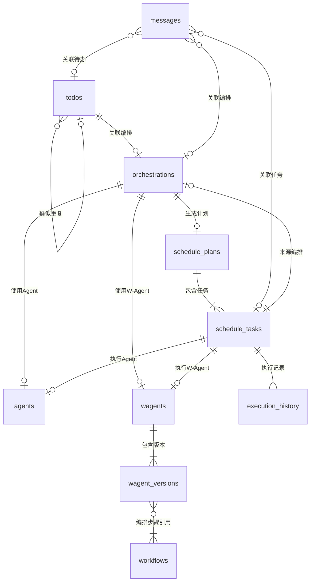

# BACKEND_STRUCTURE.md — Audit Coworker 后端架构与数据模型

> 数据库 Schema 每张表、每列、类型和关系。API 端点合约。存储规则。边缘情况。
> AI 根据此蓝图构建后端，不根据假设。

---

## 1. 项目目录结构

```
backend/
  ├── app/
  │   ├── __init__.py
  │   ├── main.py                   # FastAPI 入口，注册路由、中间件、事件
  │   ├── config.py                 # 应用配置（Pydantic Settings）
  │   ├── database.py               # 数据库引擎、Session 工厂
  │   │
  │   ├── models/                   # SQLAlchemy ORM 模型
  │   │   ├── __init__.py
  │   │   ├── base.py               # 声明性基类 + 公共 Mixin
  │   │   ├── todo.py
  │   │   ├── agent.py
  │   │   ├── workflow.py
  │   │   ├── wagent.py
  │   │   ├── datasource.py
  │   │   ├── llm_config.py
  │   │   ├── schedule.py
  │   │   ├── execution.py
  │   │   ├── message.py
  │   │   ├── notification_channel.py
  │   │   ├── notification_pref.py
  │   │   ├── settings.py
  │   │   └── audit_log.py
  │   │
  │   ├── schemas/                  # Pydantic 请求/响应 Schema
  │   │   ├── __init__.py
  │   │   ├── todo.py
  │   │   ├── agent.py
  │   │   ├── workflow.py
  │   │   ├── wagent.py
  │   │   ├── datasource.py
  │   │   ├── llm_config.py
  │   │   ├── schedule.py
  │   │   ├── execution.py
  │   │   ├── message.py
  │   │   ├── notification.py
  │   │   ├── settings.py
  │   │   ├── dashboard.py
  │   │   ├── search.py
  │   │   └── common.py             # 分页、通用响应
  │   │
  │   ├── api/                      # 路由层
  │   │   ├── __init__.py
  │   │   ├── router.py             # 汇总所有子路由
  │   │   ├── todos.py
  │   │   ├── orchestration.py
  │   │   ├── scheduling.py
  │   │   ├── config_agents.py
  │   │   ├── config_workflows.py
  │   │   ├── config_wagents.py
  │   │   ├── config_datasources.py
  │   │   ├── config_llm.py
  │   │   ├── config_notifications.py
  │   │   ├── config_import_export.py
  │   │   ├── messages.py
  │   │   ├── history.py
  │   │   ├── analytics.py
  │   │   ├── dashboard.py
  │   │   ├── search.py
  │   │   ├── settings.py
  │   │   ├── audit_logs.py
  │   │   ├── system.py             # 初始化状态检测
  │   │   └── sse.py                # SSE 端点
  │   │
  │   ├── services/                 # 业务逻辑层
  │   │   ├── __init__.py
  │   │   ├── todo_service.py
  │   │   ├── orchestration_service.py
  │   │   ├── scheduling_service.py
  │   │   ├── dify_client.py        # Dify REST API 封装
  │   │   ├── llm_client.py         # LLM API 封装（多提供商）
  │   │   ├── datasource_sync.py    # 数据源同步引擎
  │   │   ├── notification_service.py  # 消息推送服务
  │   │   ├── sse_manager.py        # SSE 事件广播管理
  │   │   ├── task_queue.py         # 简单任务队列（DB 实现）
  │   │   └── audit_service.py      # 审计日志记录
  │   │
  │   ├── engine/                   # 核心引擎
  │   │   ├── __init__.py
  │   │   ├── orchestrator.py       # 编排引擎（LLM 分析 + 方案生成）
  │   │   ├── scheduler.py          # 调度引擎（任务执行 + 重试 + 熔断）
  │   │   ├── executor.py           # 执行器（调用 Dify Agent/Workflow）
  │   │   └── conflict_resolver.py  # 冲突解决器（LLM 辅助）
  │   │
  │   ├── jobs/                     # 定时任务定义
  │   │   ├── __init__.py
  │   │   ├── sync_job.py           # 数据源同步定时任务
  │   │   ├── scheduler_job.py      # 调度引擎定时触发
  │   │   └── cleanup_job.py        # 数据清理/归档
  │   │
  │   └── utils/                    # 工具模块
  │       ├── __init__.py
  │       ├── time_utils.py         # 时间窗口判断、Cron 解析
  │       └── param_validator.py    # 参数类型校验工具
  │
  ├── migrations/                   # Alembic 迁移脚本
  │   ├── env.py
  │   ├── versions/
  │   └── alembic.ini
  │
  ├── tests/                        # 测试
  │   ├── __init__.py
  │   ├── conftest.py               # Fixtures
  │   ├── test_todos.py
  │   ├── test_orchestration.py
  │   ├── test_scheduling.py
  │   └── ...
  │
  ├── .env.example                  # 环境变量模板
  ├── requirements.txt              # 生产依赖
  ├── requirements-dev.txt          # 开发依赖
  └── pyproject.toml
```

---

## 2. 数据库 Schema（SQLite / SQLAlchemy ORM）

> 所有表使用 `id` (String UUID) 作为主键，包含 `created_at` 和 `updated_at` 时间戳。
> 预留 `user_id` 字段供多用户扩展，V1 固定为默认用户 `"default"`。

### 2.1 公共 Mixin

```python
class TimestampMixin:
    id: Mapped[str] = mapped_column(String(36), primary_key=True, default=lambda: str(uuid4()))
    created_at: Mapped[datetime] = mapped_column(DateTime, default=func.now())
    updated_at: Mapped[datetime] = mapped_column(DateTime, default=func.now(), onupdate=func.now())
    user_id: Mapped[str] = mapped_column(String(36), default="default", index=True)
```

---

### 2.2 todos — 待办任务表

| 列名 | 类型 | 约束 | 说明 |
| --- | --- | --- | --- |
| id | String(36) | PK | UUID |
| title | String(500) | NOT NULL | 任务标题 |
| description | Text | NULLABLE | 任务描述 |
| status | String(20) | NOT NULL, DEFAULT 'pending' | 枚举：pending / confirmed / processing / completed / archived |
| priority | String(10) | DEFAULT 'medium' | 枚举：high / medium / low |
| source | String(20) | NOT NULL | 枚举：manual / email / calendar / project |
| source_ref | String(500) | NULLABLE | 来源原始引用（邮件ID/日程ID等） |
| due_date | DateTime | NULLABLE | 截止时间 |
| tags | JSON | DEFAULT '[]' | 标签数组 |
| project | String(200) | NULLABLE | 关联项目名称 |
| review_status | String(20) | NULLABLE | 枚举：pending_review / confirmed / rejected（LLM 梳理状态） |
| review_reason | Text | NULLABLE | LLM 推荐理由 |
| duplicate_of | String(36) | FK(todos.id), NULLABLE | 疑似重复的目标任务ID |
| orchestration_id | String(36) | FK(orchestrations.id), NULLABLE | 关联的编排ID |
| user_id | String(36) | INDEX, DEFAULT 'default' | 用户ID（预留） |
| created_at | DateTime | DEFAULT now() | 创建时间 |
| updated_at | DateTime | DEFAULT now() | 更新时间 |

**索引：**
- `idx_todos_status` ON (status)
- `idx_todos_review_status` ON (review_status)
- `idx_todos_due_date` ON (due_date)
- `idx_todos_source` ON (source)
- `idx_todos_user_id` ON (user_id)

---

### 2.3 agents — Agent 配置表

| 列名 | 类型 | 约束 | 说明 |
| --- | --- | --- | --- |
| id | String(36) | PK | UUID |
| name | String(200) | NOT NULL, UNIQUE | Agent 名称 |
| description | Text | NULLABLE | 功能描述 |
| capability_tags | JSON | DEFAULT '[]' | 能力标签（LLM 匹配用） |
| dify_endpoint | String(500) | NOT NULL | Dify API 端点 URL |
| dify_api_key | String(500) | NOT NULL | Dify API Key（加密存储） |
| input_params | JSON | NOT NULL | 输入参数定义 `[{name, type, required, default, description}]` |
| output_params | JSON | NOT NULL | 输出参数定义 `[{name, type, description}]` |
| timeout_seconds | Integer | DEFAULT 300 | 最大等待秒数 |
| auto_execute | Boolean | DEFAULT false | 匹配时允许跳过确认直接执行 |
| confirm_before_exec | Boolean | DEFAULT true | 调度执行前需要确认弹窗 |
| is_enabled | Boolean | DEFAULT true | 是否启用 |
| call_count | Integer | DEFAULT 0 | 累计调用次数 |
| success_count | Integer | DEFAULT 0 | 累计成功次数 |
| user_id | String(36) | INDEX, DEFAULT 'default' | |
| created_at | DateTime | | |
| updated_at | DateTime | | |

**索引：**
- `idx_agents_name` ON (name)
- `idx_agents_is_enabled` ON (is_enabled)

---

### 2.4 workflows — Workflow 配置表

| 列名 | 类型 | 约束 | 说明 |
| --- | --- | --- | --- |
| id | String(36) | PK | UUID |
| name | String(200) | NOT NULL, UNIQUE | Workflow 名称 |
| description | Text | NULLABLE | |
| capability_tags | JSON | DEFAULT '[]' | 能力标签 |
| dify_endpoint | String(500) | NOT NULL | Dify API 端点 |
| dify_api_key | String(500) | NOT NULL | Dify API Key |
| input_params | JSON | NOT NULL | 输入参数定义 |
| output_params | JSON | NOT NULL | 输出参数定义 |
| timeout_seconds | Integer | DEFAULT 300 | |
| is_enabled | Boolean | DEFAULT true | |
| user_id | String(36) | INDEX, DEFAULT 'default' | |
| created_at | DateTime | | |
| updated_at | DateTime | | |

---

### 2.5 wagents — W-Agent 配置表

| 列名 | 类型 | 约束 | 说明 |
| --- | --- | --- | --- |
| id | String(36) | PK | UUID |
| name | String(200) | NOT NULL | W-Agent 名称 |
| description | Text | NULLABLE | |
| capability_tags | JSON | DEFAULT '[]' | |
| current_version | Integer | DEFAULT 1 | 当前活跃版本号 |
| input_params | JSON | NOT NULL | W-Agent 整体输入参数定义 |
| output_params | JSON | NOT NULL | W-Agent 整体输出参数定义 |
| timeout_seconds | Integer | DEFAULT 600 | |
| auto_execute | Boolean | DEFAULT false | |
| confirm_before_exec | Boolean | DEFAULT true | |
| is_enabled | Boolean | DEFAULT true | |
| source | String(20) | DEFAULT 'manual' | 创建来源：manual / orchestration |
| call_count | Integer | DEFAULT 0 | |
| success_count | Integer | DEFAULT 0 | |
| user_id | String(36) | INDEX, DEFAULT 'default' | |
| created_at | DateTime | | |
| updated_at | DateTime | | |

---

### 2.6 wagent_versions — W-Agent 版本表

| 列名 | 类型 | 约束 | 说明 |
| --- | --- | --- | --- |
| id | String(36) | PK | UUID |
| wagent_id | String(36) | FK(wagents.id), NOT NULL | 所属 W-Agent |
| version | Integer | NOT NULL | 版本号 |
| steps | JSON | NOT NULL | 步骤定义（见下方结构） |
| input_params | JSON | NOT NULL | 该版本的输入参数 |
| output_params | JSON | NOT NULL | 该版本的输出参数 |
| change_note | String(500) | NULLABLE | 变更说明 |
| created_at | DateTime | | |

**steps JSON 结构：**
```json
[
  {
    "order": 1,
    "workflow_id": "uuid",
    "workflow_name": "名称",
    "execution_mode": "serial",
    "param_mapping": {
      "input_param_name": {
        "source": "upstream_output | wagent_input | fixed_value",
        "upstream_step": 0,
        "upstream_param": "param_name",
        "fixed_value": "value"
      }
    }
  }
]
```

**唯一约束：** `UNIQUE(wagent_id, version)`

---

### 2.7 datasources — 数据源配置表

| 列名 | 类型 | 约束 | 说明 |
| --- | --- | --- | --- |
| id | String(36) | PK | UUID |
| type | String(20) | NOT NULL, UNIQUE | 枚举：email / calendar / project |
| name | String(200) | NOT NULL | 数据源名称 |
| dify_endpoint | String(500) | NOT NULL | Dify Agent 端点 |
| dify_api_key | String(500) | NOT NULL | Dify API Key |
| input_params | JSON | DEFAULT '[]' | |
| output_params | JSON | DEFAULT '[]' | |
| is_enabled | Boolean | DEFAULT true | |
| last_sync_at | DateTime | NULLABLE | 上次成功同步时间 |
| last_sync_status | String(20) | NULLABLE | success / failed / running |
| last_sync_error | Text | NULLABLE | 上次同步失败的错误信息 |
| sync_data_cache | JSON | NULLABLE | 上次同步结果缓存 |
| user_id | String(36) | INDEX, DEFAULT 'default' | |
| created_at | DateTime | | |
| updated_at | DateTime | | |

---

### 2.8 llm_configs — 大模型配置表

| 列名 | 类型 | 约束 | 说明 |
| --- | --- | --- | --- |
| id | String(36) | PK | UUID |
| purpose | String(20) | NOT NULL, UNIQUE | 枚举：todo_review / orchestration / scheduling |
| provider | String(50) | NOT NULL | openai / azure / deepseek / qwen / dify / custom |
| model_name | String(200) | NOT NULL | 模型名称 |
| api_endpoint | String(500) | NOT NULL | API 端点 |
| api_key | String(500) | NOT NULL | API Key（加密存储） |
| temperature | Float | DEFAULT 0.7 | |
| top_p | Float | DEFAULT 1.0 | |
| max_tokens | Integer | DEFAULT 4096 | |
| prompt_template | Text | NOT NULL | Prompt 模板 |
| prompt_version | Integer | DEFAULT 1 | Prompt 版本号 |
| total_tokens_used | BigInteger | DEFAULT 0 | 累计 Token 用量 |
| total_cost | Float | DEFAULT 0.0 | 累计费用 |
| cost_alert_threshold | Float | NULLABLE | 费用预警阈值 |
| user_preferences | JSON | DEFAULT '{}' | 偏好学习数据 |
| user_id | String(36) | INDEX, DEFAULT 'default' | |
| created_at | DateTime | | |
| updated_at | DateTime | | |

---

### 2.9 orchestrations — 编排方案表

| 列名 | 类型 | 约束 | 说明 |
| --- | --- | --- | --- |
| id | String(36) | PK | UUID |
| status | String(20) | NOT NULL, DEFAULT 'analyzing' | analyzing / pending_confirm / confirmed / cancelled / failed |
| todo_ids | JSON | NOT NULL | 关联待办 ID 数组 |
| plan_type | String(20) | NULLABLE | agent / wagent / new_wagent |
| agent_id | String(36) | FK(agents.id), NULLABLE | 推荐的 Agent |
| wagent_id | String(36) | FK(wagents.id), NULLABLE | 推荐的 W-Agent |
| new_wagent_steps | JSON | NULLABLE | 新编排的 Workflow 步骤（同 wagent_versions.steps） |
| new_wagent_name | String(200) | NULLABLE | 新 W-Agent 建议名称 |
| input_params_filled | JSON | NULLABLE | LLM 自动填充的输入参数 |
| priority | String(10) | DEFAULT 'medium' | LLM 建议优先级 |
| scheduled_start | DateTime | NULLABLE | 计划开始时间 |
| estimated_duration | Integer | NULLABLE | 预计耗时（秒） |
| deadline | DateTime | NULLABLE | 截止时间 |
| dependencies | JSON | DEFAULT '[]' | 依赖的其他编排ID数组 |
| llm_reason | Text | NULLABLE | LLM 推荐理由 |
| llm_raw_response | Text | NULLABLE | LLM 原始返回（调试用） |
| confirmed_at | DateTime | NULLABLE | 用户确认时间 |
| schedule_plan_id | String(36) | FK(schedule_plans.id), NULLABLE | 关联调度计划 |
| user_id | String(36) | INDEX, DEFAULT 'default' | |
| created_at | DateTime | | |
| updated_at | DateTime | | |

---

### 2.10 schedule_plans — 调度计划表

| 列名 | 类型 | 约束 | 说明 |
| --- | --- | --- | --- |
| id | String(36) | PK | UUID |
| name | String(500) | NOT NULL | 计划名称 |
| status | String(20) | NOT NULL, DEFAULT 'active' | active / paused / completed / cancelled |
| is_recurring | Boolean | DEFAULT false | 是否循环 |
| recurrence_cron | String(100) | NULLABLE | 循环 Cron 表达式 |
| recurrence_count | Integer | DEFAULT 0 | 已循环次数 |
| next_run_at | DateTime | NULLABLE | 下次循环执行时间 |
| user_id | String(36) | INDEX, DEFAULT 'default' | |
| created_at | DateTime | | |
| updated_at | DateTime | | |

---

### 2.11 schedule_tasks — 调度任务表

| 列名 | 类型 | 约束 | 说明 |
| --- | --- | --- | --- |
| id | String(36) | PK | UUID |
| plan_id | String(36) | FK(schedule_plans.id), NOT NULL | 所属调度计划 |
| orchestration_id | String(36) | FK(orchestrations.id), NOT NULL | 关联编排方案 |
| agent_id | String(36) | FK(agents.id), NULLABLE | 执行的 Agent |
| wagent_id | String(36) | FK(wagents.id), NULLABLE | 执行的 W-Agent |
| wagent_version | Integer | NULLABLE | 使用的 W-Agent 版本 |
| status | String(20) | NOT NULL, DEFAULT 'pending' | pending / confirming / running / completed / failed / skipped / blocked / paused / delayed / retrying |
| priority | String(10) | DEFAULT 'medium' | |
| scheduled_at | DateTime | NOT NULL | 计划执行时间 |
| started_at | DateTime | NULLABLE | 实际开始时间 |
| completed_at | DateTime | NULLABLE | 实际完成时间 |
| input_params | JSON | NULLABLE | 执行输入参数 |
| output_result | JSON | NULLABLE | 执行输出结果 |
| error_message | Text | NULLABLE | 错误信息 |
| retry_count | Integer | DEFAULT 0 | 已重试次数 |
| max_retries | Integer | DEFAULT 3 | 最大重试次数 |
| dependencies | JSON | DEFAULT '[]' | 依赖的任务 ID 数组 |
| confirm_deadline | DateTime | NULLABLE | 确认超时截止时间 |
| confirm_action | String(20) | NULLABLE | 超时默认动作 |
| execution_log | Text | NULLABLE | 执行日志（追加写入） |
| user_id | String(36) | INDEX, DEFAULT 'default' | |
| created_at | DateTime | | |
| updated_at | DateTime | | |

**索引：**
- `idx_tasks_status` ON (status)
- `idx_tasks_plan_id` ON (plan_id)
- `idx_tasks_scheduled_at` ON (scheduled_at)

---

### 2.12 execution_history — 执行历史表

| 列名 | 类型 | 约束 | 说明 |
| --- | --- | --- | --- |
| id | String(36) | PK | UUID |
| task_id | String(36) | FK(schedule_tasks.id), NOT NULL | 关联调度任务 |
| agent_id | String(36) | NULLABLE | |
| wagent_id | String(36) | NULLABLE | |
| agent_name | String(200) | | 冗余存储（历史不跟随配置变更） |
| status | String(20) | NOT NULL | completed / failed |
| input_params | JSON | | |
| output_result | JSON | | |
| error_message | Text | NULLABLE | |
| execution_log | Text | NULLABLE | |
| duration_ms | Integer | | 耗时毫秒 |
| tokens_used | Integer | DEFAULT 0 | LLM Token 消耗 |
| retry_attempt | Integer | DEFAULT 0 | 第几次尝试 |
| started_at | DateTime | NOT NULL | |
| completed_at | DateTime | NOT NULL | |
| user_id | String(36) | INDEX, DEFAULT 'default' | |
| created_at | DateTime | | |

**索引：**
- `idx_history_task_id` ON (task_id)
- `idx_history_agent_id` ON (agent_id)
- `idx_history_status` ON (status)
- `idx_history_started_at` ON (started_at)

---

### 2.13 messages — 消息表

| 列名 | 类型 | 约束 | 说明 |
| --- | --- | --- | --- |
| id | String(36) | PK | UUID |
| type | String(30) | NOT NULL | 消息类型枚举（见下方） |
| title | String(500) | NOT NULL | 消息标题 |
| content | Text | NOT NULL | 消息正文 |
| status | String(20) | DEFAULT 'unread' | unread / read / processed |
| related_type | String(30) | NULLABLE | 关联对象类型：todo / orchestration / schedule_task / sync |
| related_id | String(36) | NULLABLE | 关联对象 ID |
| action_url | String(500) | NULLABLE | 前端跳转路由 |
| external_pushed | Boolean | DEFAULT false | 是否已推送外部渠道 |
| user_id | String(36) | INDEX, DEFAULT 'default' | |
| created_at | DateTime | | |

**消息类型枚举：**
- `review_new` — 新梳理结果待确认
- `orchestration_confirm` — 编排方案待确认
- `task_confirm` — 执行前确认
- `task_completed` — 任务完成
- `task_failed` — 任务失败
- `plan_changed` — 调度计划变更
- `sync_completed` — 数据同步完成
- `sync_failed` — 数据同步失败
- `deadline_warning` — 到期预警
- `recurring_trigger` — 循环任务触发
- `circuit_breaker` — 熔断触发
- `system_alert` — 系统告警

**索引：**
- `idx_messages_status` ON (status)
- `idx_messages_type` ON (type)
- `idx_messages_created_at` ON (created_at)

---

### 2.14 notification_channels — 通知渠道配置表

| 列名 | 类型 | 约束 | 说明 |
| --- | --- | --- | --- |
| id | String(36) | PK | UUID |
| channel_type | String(20) | NOT NULL, UNIQUE | email_workflow / wechat_workflow |
| name | String(200) | NOT NULL | |
| dify_endpoint | String(500) | NOT NULL | Dify Workflow 端点 |
| dify_api_key | String(500) | NOT NULL | |
| input_mapping | JSON | NOT NULL | 参数映射 `{recipient, subject, content}` |
| is_enabled | Boolean | DEFAULT true | |
| user_id | String(36) | INDEX, DEFAULT 'default' | |
| created_at | DateTime | | |
| updated_at | DateTime | | |

---

### 2.15 notification_prefs — 用户提醒偏好表

| 列名 | 类型 | 约束 | 说明 |
| --- | --- | --- | --- |
| id | String(36) | PK | UUID |
| message_type | String(30) | NOT NULL | 对应消息类型枚举 |
| in_app_enabled | Boolean | DEFAULT true | 站内通知开关 |
| email_enabled | Boolean | DEFAULT false | 邮件推送开关 |
| wechat_enabled | Boolean | DEFAULT false | 企微推送开关 |
| user_id | String(36) | INDEX, DEFAULT 'default' | |
| created_at | DateTime | | |
| updated_at | DateTime | | |

**唯一约束：** `UNIQUE(user_id, message_type)`

---

### 2.16 notification_global_prefs — 全局提醒偏好表

| 列名 | 类型 | 约束 | 说明 |
| --- | --- | --- | --- |
| id | String(36) | PK | UUID |
| dnd_start | String(5) | NULLABLE | 免打扰开始时间（HH:MM） |
| dnd_end | String(5) | NULLABLE | 免打扰结束时间（HH:MM） |
| merge_strategy | String(20) | DEFAULT 'none' | none / by_type / by_time |
| merge_window_minutes | Integer | DEFAULT 5 | 合并时间窗口 |
| deadline_advance_minutes | Integer | DEFAULT 60 | 到期预警提前量（分钟） |
| user_id | String(36) | UNIQUE, DEFAULT 'default' | |
| created_at | DateTime | | |
| updated_at | DateTime | | |

---

### 2.17 system_settings — 系统设置表

| 列名 | 类型 | 约束 | 说明 |
| --- | --- | --- | --- |
| id | String(36) | PK | UUID |
| key | String(100) | NOT NULL, UNIQUE | 设置键名 |
| value | JSON | NOT NULL | 设置值 |
| description | String(500) | NULLABLE | 说明 |
| updated_at | DateTime | | |

**预置键名：**

| key | 默认 value | 说明 |
| --- | --- | --- |
| `execution_time_windows` | `{"mon":["09:00","18:00"],...}` | 每天执行时间窗口 |
| `max_concurrency` | `3` | 最大并发 |
| `sync_frequency_minutes` | `60` | 同步频率（分钟） |
| `confirm_timeout_minutes` | `30` | 确认超时 |
| `confirm_timeout_action` | `"delay"` | 超时默认动作 |
| `max_confirm_retries` | `3` | 最大确认重试 |
| `max_task_retries` | `3` | 最大任务重试 |
| `retry_strategy` | `"exponential"` | 重试策略 |
| `circuit_breaker_threshold` | `5` | 熔断阈值 |
| `message_retention_days` | `90` | 消息保留天数 |
| `history_retention_days` | `180` | 历史保留天数 |
| `audit_log_retention_days` | `365` | 审计日志保留 |
| `archive_completed_days` | `7` | 完成任务归档天数 |
| `dify_rate_limit_qps` | `10` | Dify API QPS 限制 |
| `initialized` | `false` | 系统是否已初始化 |

---

### 2.18 audit_logs — 操作审计日志表

| 列名 | 类型 | 约束 | 说明 |
| --- | --- | --- | --- |
| id | String(36) | PK | UUID |
| action | String(50) | NOT NULL | 操作类型（见下方） |
| resource_type | String(50) | NOT NULL | 操作对象类型 |
| resource_id | String(36) | NULLABLE | 操作对象ID |
| resource_name | String(200) | NULLABLE | 操作对象名称 |
| details | JSON | NULLABLE | 操作详情（变更前后值） |
| ip_address | String(50) | NULLABLE | 客户端IP |
| user_id | String(36) | DEFAULT 'default' | |
| created_at | DateTime | NOT NULL | |

**操作类型枚举：**
- `create` / `update` / `delete` / `enable` / `disable`
- `confirm` / `reject` / `skip` / `cancel` / `retry`
- `pause` / `resume` / `rollback`
- `import` / `export`
- `sync_trigger` / `test_connection`
- `login` / `logout`（预留）

**索引：**
- `idx_audit_action` ON (action)
- `idx_audit_resource` ON (resource_type, resource_id)
- `idx_audit_created_at` ON (created_at)

---

### 2.19 task_queue — 简单任务队列表（V1 DB 实现）

| 列名 | 类型 | 约束 | 说明 |
| --- | --- | --- | --- |
| id | String(36) | PK | UUID |
| task_type | String(50) | NOT NULL | 任务类型：execute_agent / execute_wagent / sync_datasource / send_notification |
| payload | JSON | NOT NULL | 任务参数 |
| status | String(20) | DEFAULT 'pending' | pending / processing / completed / failed |
| priority | Integer | DEFAULT 0 | 优先级（数字越大越优先） |
| scheduled_at | DateTime | NULLABLE | 计划执行时间 |
| picked_at | DateTime | NULLABLE | 被取出时间 |
| completed_at | DateTime | NULLABLE | 完成时间 |
| error_message | Text | NULLABLE | |
| retry_count | Integer | DEFAULT 0 | |
| max_retries | Integer | DEFAULT 3 | |
| created_at | DateTime | | |

**索引：**
- `idx_queue_status_priority` ON (status, priority DESC, scheduled_at)

---

### 2.20 llm_usage_logs — LLM 用量日志表

| 列名 | 类型 | 约束 | 说明 |
| --- | --- | --- | --- |
| id | String(36) | PK | UUID |
| purpose | String(20) | NOT NULL | todo_review / orchestration / scheduling |
| model_name | String(200) | NOT NULL | |
| prompt_tokens | Integer | NOT NULL | |
| completion_tokens | Integer | NOT NULL | |
| total_tokens | Integer | NOT NULL | |
| estimated_cost | Float | DEFAULT 0.0 | |
| request_id | String(100) | NULLABLE | 关联的业务请求ID |
| created_at | DateTime | NOT NULL | |

**索引：**
- `idx_llm_usage_purpose` ON (purpose)
- `idx_llm_usage_created_at` ON (created_at)

---

## 3. 关系图（ER Diagram）



---

## 4. API 端点合约

> 所有 API 以 `/api` 为前缀。响应格式统一为：
```json
{
  "code": 200,
  "message": "success",
  "data": { ... }
}
```
> 错误响应：
```json
{
  "code": 400,
  "message": "错误描述",
  "data": null
}
```

### 4.1 系统

| 方法 | 路径 | 说明 |
| --- | --- | --- |
| GET | `/api/system/init-status` | 检测系统是否已初始化 |
| POST | `/api/system/init-complete` | 标记初始化完成 |
| GET | `/api/search?q={keyword}` | 全局搜索 |

### 4.2 Dashboard

| 方法 | 路径 | 说明 |
| --- | --- | --- |
| GET | `/api/dashboard/stats` | 关键指标统计 |
| GET | `/api/dashboard/next-task` | 下一个即将执行的任务 |
| GET | `/api/dashboard/trend` | 近 7 天完成趋势 |
| GET | `/api/dashboard/agent-ranking` | Agent 调用频次排行 |
| GET | `/api/dashboard/sync-status` | 数据源同步状态 |

### 4.3 待办任务

| 方法 | 路径 | 说明 |
| --- | --- | --- |
| GET | `/api/todos?status=&priority=&source=&page=&size=&sort=` | 获取待办列表（分页、筛选、排序） |
| POST | `/api/todos` | 创建待办 |
| PUT | `/api/todos/{id}` | 更新待办 |
| DELETE | `/api/todos/{id}` | 删除待办 |
| POST | `/api/todos/batch-import` | 批量导入（multipart/form-data，Excel 文件） |
| GET | `/api/todos/review-pending` | 获取待确认的 LLM 梳理结果 |
| PATCH | `/api/todos/review/{id}/confirm` | 确认梳理结果（body 可含修改字段） |
| PATCH | `/api/todos/review/{id}/reject` | 拒绝梳理结果 |
| POST | `/api/todos/review/batch-confirm` | 批量确认 `{ ids: [...] }` |
| POST | `/api/todos/review/batch-reject` | 批量拒绝 `{ ids: [...] }` |

### 4.4 智能编排

| 方法 | 路径 | 说明 |
| --- | --- | --- |
| POST | `/api/orchestration/submit` | 提交待办到编排 `{ todoIds: [...] }` |
| GET | `/api/orchestration/pending` | 获取待确认编排列表 |
| GET | `/api/orchestration/{id}` | 获取编排详情 |
| POST | `/api/orchestration/{id}/confirm` | 确认编排方案 |
| POST | `/api/orchestration/{id}/confirm-wagent` | 确认 Workflow 编排并保存为 W-Agent |
| PATCH | `/api/orchestration/{id}/modify-agent` | 用户更换 Agent `{ agentId / wagentId }` |
| PATCH | `/api/orchestration/{id}/modify-params` | 修改输入参数 `{ params: {...} }` |
| POST | `/api/orchestration/{id}/cancel` | 取消编排 |

### 4.5 调度监控

| 方法 | 路径 | 说明 |
| --- | --- | --- |
| GET | `/api/scheduling/tasks?status=&page=&size=` | 获取调度任务列表 |
| GET | `/api/scheduling/tasks/{id}` | 获取任务详情 |
| GET | `/api/scheduling/gantt?start=&end=` | 获取甘特图数据 |
| POST | `/api/scheduling/{id}/confirm-execute` | 确认执行 |
| POST | `/api/scheduling/{id}/delay` | 延后执行 `{ delayMinutes }` |
| POST | `/api/scheduling/{id}/skip` | 跳过任务 |
| POST | `/api/scheduling/{id}/cancel` | 取消任务 |
| POST | `/api/scheduling/{id}/retry` | 手动重试 |
| POST | `/api/scheduling/plans/{id}/pause` | 暂停调度计划 |
| POST | `/api/scheduling/plans/{id}/resume` | 恢复调度计划 |
| POST | `/api/scheduling/plans/{id}/cancel` | 取消调度计划 |

### 4.6 Agent 配置

| 方法 | 路径 | 说明 |
| --- | --- | --- |
| GET | `/api/config/agents` | 获取 Agent 列表 |
| GET | `/api/config/agents/{id}` | 获取 Agent 详情 |
| POST | `/api/config/agents` | 新建 Agent |
| PUT | `/api/config/agents/{id}` | 更新 Agent |
| DELETE | `/api/config/agents/{id}` | 删除 Agent |
| PATCH | `/api/config/agents/{id}/toggle` | 启用/禁用 |
| POST | `/api/config/agents/{id}/test` | 测试连接 |

### 4.7 Workflow 配置

| 方法 | 路径 | 说明 |
| --- | --- | --- |
| GET | `/api/config/workflows` | 获取 Workflow 列表 |
| GET | `/api/config/workflows/{id}` | 获取 Workflow 详情 |
| POST | `/api/config/workflows` | 新建 |
| PUT | `/api/config/workflows/{id}` | 更新 |
| DELETE | `/api/config/workflows/{id}` | 删除 |
| PATCH | `/api/config/workflows/{id}/toggle` | 启用/禁用 |
| POST | `/api/config/workflows/{id}/test` | 测试连接 |

### 4.8 W-Agent 配置

| 方法 | 路径 | 说明 |
| --- | --- | --- |
| GET | `/api/config/wagents` | 获取 W-Agent 列表 |
| GET | `/api/config/wagents/{id}` | 获取 W-Agent 详情（含当前版本步骤） |
| POST | `/api/config/wagents` | 新建 W-Agent |
| PUT | `/api/config/wagents/{id}` | 更新 W-Agent（若执行中则自动保存为新版本） |
| DELETE | `/api/config/wagents/{id}` | 删除 |
| PATCH | `/api/config/wagents/{id}/toggle` | 启用/禁用 |
| GET | `/api/config/wagents/{id}/versions` | 获取版本列表 |
| GET | `/api/config/wagents/{id}/versions/{versionId}` | 获取某版本详情 |
| POST | `/api/config/wagents/{id}/rollback/{versionId}` | 回滚到指定版本 |
| POST | `/api/config/wagents/{id}/test` | 测试执行 |

### 4.9 数据源配置

| 方法 | 路径 | 说明 |
| --- | --- | --- |
| GET | `/api/config/datasources` | 获取所有数据源配置 |
| PUT | `/api/config/datasources/{type}` | 更新数据源配置（type = email/calendar/project） |
| PATCH | `/api/config/datasources/{type}/toggle` | 启用/禁用 |
| POST | `/api/config/datasources/{type}/test` | 测试连接 |
| POST | `/api/config/datasources/{type}/sync` | 手动触发同步 |

### 4.10 大模型配置

| 方法 | 路径 | 说明 |
| --- | --- | --- |
| GET | `/api/config/llm` | 获取所有 LLM 配置 |
| GET | `/api/config/llm/{purpose}` | 获取指定用途的 LLM 配置 |
| PUT | `/api/config/llm/{purpose}` | 更新 LLM 配置 |
| POST | `/api/config/llm/{purpose}/test` | 测试 LLM 连接 |
| GET | `/api/config/llm/{purpose}/usage` | 获取用量统计 |
| POST | `/api/config/llm/{purpose}/reset-preferences` | 重置偏好学习数据 |

### 4.11 通知渠道配置

| 方法 | 路径 | 说明 |
| --- | --- | --- |
| GET | `/api/config/notifications` | 获取所有通知渠道 |
| PUT | `/api/config/notifications/{channelType}` | 更新渠道配置 |
| PATCH | `/api/config/notifications/{channelType}/toggle` | 启用/禁用 |
| POST | `/api/config/notifications/{channelType}/test` | 测试发送 |

### 4.12 配置导入/导出

| 方法 | 路径 | 说明 |
| --- | --- | --- |
| GET | `/api/config/export` | 导出所有配置（JSON 文件下载） |
| POST | `/api/config/import` | 导入配置（multipart/form-data） |
| POST | `/api/config/import/preview` | 导入预览（检测冲突） |

### 4.13 消息中心

| 方法 | 路径 | 说明 |
| --- | --- | --- |
| GET | `/api/messages?type=&status=&page=&size=` | 获取消息列表 |
| GET | `/api/messages/unread-count` | 获取未读数 |
| PATCH | `/api/messages/{id}/read` | 标记已读 |
| PATCH | `/api/messages/{id}/processed` | 标记已处理 |
| POST | `/api/messages/batch-read` | 批量标记已读 `{ ids: [...] }` |
| DELETE | `/api/messages/batch-delete` | 批量删除 `{ ids: [...] }` |

### 4.14 执行历史与数据分析

| 方法 | 路径 | 说明 |
| --- | --- | --- |
| GET | `/api/history?agent=&status=&start=&end=&page=&size=` | 执行历史列表 |
| GET | `/api/history/{id}` | 执行历史详情 |
| GET | `/api/history/export?format=csv&start=&end=` | 导出历史记录 |
| GET | `/api/analytics/agent-stats?start=&end=` | Agent 调用统计 |
| GET | `/api/analytics/task-stats?start=&end=` | 任务统计 |
| GET | `/api/analytics/llm-usage?start=&end=` | LLM 用量统计 |

### 4.15 系统设置

| 方法 | 路径 | 说明 |
| --- | --- | --- |
| GET | `/api/settings` | 获取所有系统设置 |
| PUT | `/api/settings` | 批量更新设置 `{ key: value, ... }` |
| GET | `/api/settings/notification-prefs` | 获取提醒偏好 |
| PUT | `/api/settings/notification-prefs` | 更新提醒偏好 |
| GET | `/api/settings/notification-global` | 获取全局提醒偏好 |
| PUT | `/api/settings/notification-global` | 更新全局提醒偏好 |

### 4.16 审计日志

| 方法 | 路径 | 说明 |
| --- | --- | --- |
| GET | `/api/audit-logs?action=&resource_type=&start=&end=&page=&size=` | 查询审计日志 |

### 4.17 SSE

| 方法 | 路径 | 说明 |
| --- | --- | --- |
| GET | `/api/sse/events` | SSE 长连接端点 |

---

## 5. 存储规则与边缘情况

### 5.1 API Key 存储
- 所有 Dify API Key 和 LLM API Key 在数据库中使用 AES-256 加密存储
- 加密密钥从环境变量 `ENCRYPTION_KEY` 读取
- API 响应中 API Key 字段返回掩码形式（`sk-****1234`）
- 仅在调用 Dify/LLM 时解密使用

### 5.2 并发控制
- 调度引擎使用数据库锁（SELECT ... FOR UPDATE）防止并发取任务
- SQLite 单写多读特性下，写操作自动串行化
- 任务队列取任务时使用乐观锁（version 字段）

### 5.3 超时与熔断
- Agent/Workflow 调用超时：使用 httpx 的 timeout 参数，默认 300 秒
- 确认超时：APScheduler 定时检查超时任务
- 熔断机制：同一 Agent 连续失败 N 次（默认 5）触发熔断，标记该 Agent 所有待执行任务为 blocked，推送告警

### 5.4 数据清理策略
- APScheduler 每日凌晨 2:00 执行清理任务
- 根据 system_settings 中的保留天数配置删除过期数据
- 审计日志仅支持物理删除（按日期），不支持单条删除
- 已完成任务超过归档天数自动标记为 archived 状态

### 5.5 SSE 管理
- SSE 连接使用 asyncio.Queue 实现事件广播
- 客户端断开后自动清理对应 Queue
- SSE 每 30 秒发送心跳事件（`event: heartbeat`）
- 前端断开后指数退避重连（1s → 2s → 4s → 8s → 最大 30s）

### 5.6 Dify API 调用
- 统一使用 httpx AsyncClient 长连接池
- 遵守系统设置的 QPS/QPM 限制（令牌桶算法）
- Agent 均为 Completion 模式（阻塞调用，单次请求返回结果）
- 请求/响应全量记录到 execution_history

### 5.7 数据同步冲突处理
- 新同步数据与现有待办的去重：LLM 语义比对，相似度 > 阈值标记为疑似重复
- 调度计划冲突（时间/资源竞争）：LLM 自动调整 + 用户确认
- W-Agent 编辑中执行：正在执行的使用旧版本，新保存创建新版本

### 5.8 优雅关闭
- 收到 SIGTERM 后：
  1. 停止接受新任务
  2. 等待当前执行中的任务完成（最长等待 60 秒）
  3. 超时后强制标记为 failed + 记录日志
  4. 关闭数据库连接和 SSE 连接
