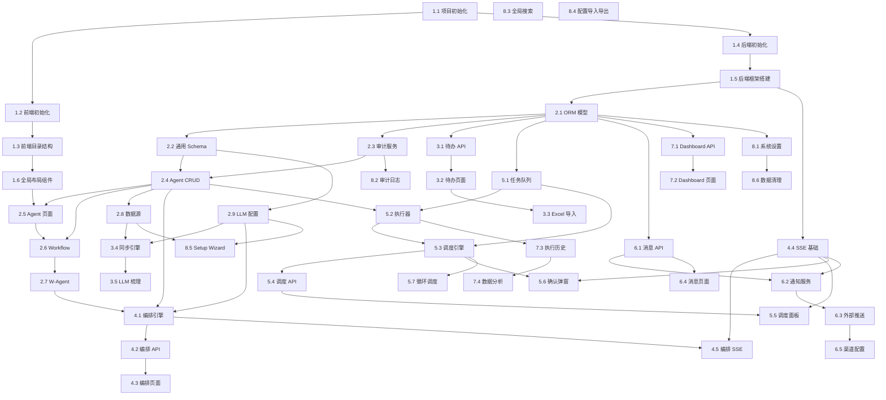

# IMPLEMENTATION_PLAN.md — Audit Coworker 逐步构建序列

> 逐步构建序列。不是"构建应用"，而是精确到每个步骤的执行指令。
> 每个步骤标注依赖关系和验证标准。

---

## 阶段总览

| 阶段 | 名称 | 步骤范围 | 预计工时 | 核心交付物 |
| --- | --- | --- | --- | --- |
| P0 | 项目初始化与基础设施 | 1.1 ~ 1.6 | 2 天 | 可运行的前后端骨架 |
| P1 | 数据模型与配置管理 | 2.1 ~ 2.9 | 4 天 | Agent/Workflow/W-Agent/数据源/LLM 配置 CRUD |
| P2 | 待办任务模块 | 3.1 ~ 3.5 | 3 天 | 待办 CRUD + 批量导入 + 数据源同步 + LLM 梳理 |
| P3 | 智能编排模块 | 4.1 ~ 4.5 | 4 天 | LLM 编排 + 方案确认 + W-Agent 自动创建 |
| P4 | 调度引擎模块 | 5.1 ~ 5.7 | 5 天 | 任务队列 + 调度执行 + 重试/熔断 + 确认弹窗 |
| P5 | 消息通知模块 | 6.1 ~ 6.5 | 3 天 | 站内通知 + SSE 实时推送 + 外部渠道推送 |
| P6 | Dashboard 与数据分析 | 7.1 ~ 7.4 | 3 天 | 总览页 + 执行历史 + 数据分析图表 |
| P7 | 系统完善 | 8.1 ~ 8.6 | 3 天 | 系统设置 + 审计日志 + 全局搜索 + Setup Wizard |
| P8 | 联调与优化 | 9.1 ~ 9.5 | 3 天 | 端到端测试 + 性能优化 + 部署准备 |

**总预计工时：~30 个工作日**

---

## P0: 项目初始化与基础设施

### 步骤 1.1 — 创建项目根目录与 Git 初始化

```
操作：
  1. 在 "Audit Coworker new" 目录下创建根结构：
     ├── frontend/
     ├── backend/
     ├── docs/         （存放 5 份设计文档）
     └── .gitignore
  2. git init
  3. 创建 .gitignore（Node、Python、IDE、.env）
  4. 将 TECH_STACK.md / APP_FLOW.md / FRONTEND_GUIDELINES.md / 
     BACKEND_STRUCTURE.md / IMPLEMENTATION_PLAN.md 移入 docs/

验证：git status 显示干净的初始化仓库
```

### 步骤 1.2 — 前端项目初始化

```
依赖：步骤 1.1
操作：
  1. npm create vite@7.3.1 frontend -- --template react-ts
  2. cd frontend
  3. 安装核心依赖（参照 TECH_STACK.md 2.1~2.7 所有包及精确版本）：
     npm install react@19.2.4 react-dom@19.2.4 antd@6.3.1 
       @ant-design/icons@6.0.0 react-router-dom@7.13.1 
       zustand@5.0.11 axios@1.9.0 dayjs@1.11.13 
       echarts@6.0.0 echarts-for-react@3.0.6 dhtmlx-gantt@9.1.2 
       eventsource-parser@3.0.1 xlsx@0.18.5 file-saver@2.0.5
  4. 安装开发依赖：
     npm install -D eslint@9.21.0 prettier@3.5.3 
       @typescript-eslint/eslint-plugin@8.26.0 
       @typescript-eslint/parser@8.26.0 
       @types/react@19.2.0 @types/react-dom@19.2.0 
       @types/file-saver@2.0.7
  5. 配置 ESLint + Prettier
  6. 配置 tsconfig.json（paths alias: @/ → src/）
  7. 配置 vite.config.ts（代理后端 API /api → http://localhost:8000）

验证：npm run dev 启动无报错，浏览器访问 http://localhost:5173 看到 Vite 欢迎页
```

### 步骤 1.3 — 前端目录结构与全局配置

```
依赖：步骤 1.2
操作：
  1. 按照 FRONTEND_GUIDELINES.md 第 10 节创建完整目录结构：
     src/api/ src/components/ src/pages/ src/stores/ 
     src/hooks/ src/constants/ src/types/ src/utils/ src/theme/
  2. 创建 src/theme/antdTheme.ts —— 
     粘贴 FRONTEND_GUIDELINES.md 2.1 的完整 theme 配置
  3. 创建 src/constants/status.ts —— 
     状态枚举 + 色值映射（FRONTEND_GUIDELINES.md 2.2 + 7.5）
  4. 创建 src/constants/routes.ts —— 
     路由常量（APP_FLOW.md 1.2）
  5. 创建 src/constants/menu.ts —— 
     菜单配置（APP_FLOW.md 1.1）
  6. 创建 src/api/client.ts —— 
     Axios 实例（baseURL、拦截器、错误处理）

验证：所有目录存在，TypeScript 编译无错误
```

### 步骤 1.4 — 后端项目初始化

```
依赖：步骤 1.1
操作：
  1. cd backend
  2. python -m venv .venv
  3. 激活虚拟环境
  4. 创建 requirements.txt（参照 TECH_STACK.md 3.1~3.7 所有包及精确版本）：
     fastapi==0.135.1
     uvicorn[standard]==0.41.0
     pydantic==2.10.6
     pydantic-settings==2.7.1
     sqlalchemy==2.0.48
     aiosqlite==0.20.0
     alembic==1.14.1
     httpx==0.28.1
     apscheduler==3.11.2
     sse-starlette==2.2.1
     loguru==0.7.3
     python-multipart==0.0.20
     python-dotenv==1.0.1
     orjson==3.10.15
  5. 创建 requirements-dev.txt：
     pytest==8.3.4
     pytest-asyncio==0.24.0
  6. pip install -r requirements.txt -r requirements-dev.txt
  7. 创建 .env.example：
     DATABASE_URL=sqlite+aiosqlite:///./audit_coworker.db
     ENCRYPTION_KEY=your-32-byte-key-here
     LOG_LEVEL=INFO
  8. 复制 .env.example → .env 并填入开发环境值

验证：python -c "import fastapi; print(fastapi.__version__)" 输出 0.135.1
```

### 步骤 1.5 — 后端基础框架搭建

```
依赖：步骤 1.4
操作：
  1. 按照 BACKEND_STRUCTURE.md 第 1 节创建完整目录结构
  2. 创建 app/config.py —— Pydantic Settings 配置类
  3. 创建 app/database.py —— 
     async SQLAlchemy 引擎 + async_session 工厂
  4. 创建 app/models/base.py —— 
     声明性基类 + TimestampMixin（BACKEND_STRUCTURE.md 2.1）
  5. 创建 app/main.py —— 
     FastAPI app 实例 + CORS 中间件（允许前端 localhost:5173）
     + startup/shutdown 事件（初始化数据库 + 关闭连接）
  6. 创建 app/api/router.py —— 空路由汇总文件
  7. 在 main.py 中注册 router
  8. 初始化 Alembic：alembic init migrations
  9. 配置 migrations/env.py 使用 async engine

验证：uvicorn app.main:app --reload 启动成功，
     访问 http://localhost:8000/docs 看到 Swagger UI
```

### 步骤 1.6 — 全局布局组件（前端）

```
依赖：步骤 1.3
操作：
  1. 创建 src/components/Layout/index.tsx ——
     Ant Design Layout（Header + Sider + Content）
     参照 FRONTEND_GUIDELINES.md 5.1~5.2：
     - Header: 56px，白色背景，Logo + 搜索框占位 + 通知角标占位 + 用户头像占位
     - Sider: 220px 深蓝黑背景，可折叠至 60px
     - Content: padding 24px
  2. 创建 src/components/Layout/index.module.css
  3. 创建侧边栏菜单组件 ——
     读取 menu.ts 配置渲染 Ant Design Menu
     支持路由联动高亮
  4. 配置 App.tsx ——
     ConfigProvider（theme） + BrowserRouter + Layout + Routes 骨架
  5. 创建占位页面组件 ——
     每个路由创建最简页面（标题 + "开发中"文字），
     路由列表参照 APP_FLOW.md 1.2
  6. 创建 src/stores/useGlobalStore.ts ——
     侧边栏折叠状态

验证：
  - 浏览器访问看到完整布局框架
  - 侧边栏菜单可折叠/展开
  - 点击菜单项路由切换正确
  - 每个路由显示占位页面
```

---

## P1: 数据模型与配置管理

### 步骤 2.1 — 创建所有 ORM 模型

```
依赖：步骤 1.5
操作：
  按照 BACKEND_STRUCTURE.md 2.2~2.20 依次创建所有模型文件：
  1. app/models/todo.py — Todo 模型
  2. app/models/agent.py — Agent 模型
  3. app/models/workflow.py — Workflow 模型
  4. app/models/wagent.py — WAgent + WAgentVersion 模型
  5. app/models/datasource.py — DataSource 模型
  6. app/models/llm_config.py — LLMConfig 模型
  7. app/models/schedule.py — SchedulePlan + ScheduleTask 模型
  8. app/models/execution.py — ExecutionHistory 模型
  9. app/models/message.py — Message 模型
  10. app/models/notification_channel.py — NotificationChannel 模型
  11. app/models/notification_pref.py — NotificationPref + NotificationGlobalPref
  12. app/models/settings.py — SystemSetting 模型
  13. app/models/audit_log.py — AuditLog 模型
  14. 创建 task_queue 表（在 schedule.py 或独立文件）
  15. 创建 llm_usage_logs 表
  16. 在 app/models/__init__.py 汇总导出所有模型

验证：alembic revision --autogenerate -m "init" 生成迁移脚本无报错
     alembic upgrade head 创建所有表
```

### 步骤 2.2 — 创建通用 Schema 与响应模型

```
依赖：步骤 2.1
操作：
  1. 创建 app/schemas/common.py ——
     PaginatedResponse、APIResponse、PaginationParams
  2. 创建每个模块的 Schema 文件 ——
     按 BACKEND_STRUCTURE.md 第 4 节的 API 合约定义请求/响应 Pydantic 模型
     每个 Schema 文件包含：Create、Update、Response、List 等变体

验证：所有 Schema 类可正常导入，无循环依赖
```

### 步骤 2.3 — 审计日志服务

```
依赖：步骤 2.1
操作：
  1. 创建 app/services/audit_service.py ——
     log_action(action, resource_type, resource_id, resource_name, details, request)
     异步写入 audit_logs 表
  2. 创建 FastAPI 依赖注入函数 get_audit_service

验证：单元测试验证日志写入和读取
```

### 步骤 2.4 — Agent 配置 CRUD（后端）

```
依赖：步骤 2.2, 2.3
操作：
  1. 创建 app/api/config_agents.py ——
     实现 BACKEND_STRUCTURE.md 4.6 的所有端点
  2. 包含：列表（分页）、详情、创建、更新、删除、启用禁用、测试连接
  3. 测试连接 —— 创建 app/services/dify_client.py 骨架
     test_agent_connection(endpoint, api_key) 发送简单请求验证可达性
  4. 创建、更新、删除操作调用 audit_service 记录日志
  5. 删除前检查：是否有调度任务引用该 Agent

验证：Swagger UI 测试所有 Agent CRUD 端点正常工作
```

### 步骤 2.5 — Agent 配置页面（前端）

```
依赖：步骤 1.6, 2.4
操作：
  1. 创建 src/api/config.ts ——
     agentList / agentDetail / createAgent / updateAgent / deleteAgent / 
     toggleAgent / testAgentConnection
  2. 创建 src/types/agent.ts —— Agent 类型定义
  3. 创建通用组件 src/components/ParamTable/index.tsx ——
     输入/输出参数配置表格（可增删行、类型下拉、必填勾选）
     此组件在 Agent/Workflow/W-Agent/DataSource 配置页复用
  4. 创建 src/pages/Config/Agents/index.tsx —— 
     Agent 列表页（卡片/列表展示、启用禁用、测试连接）
  5. 创建 src/pages/Config/Agents/Detail/index.tsx —— 
     Agent 详情/编辑表单页（参照 APP_FLOW.md 7.1）

验证：
  - 可新建 Agent 并看到列表
  - 测试连接按钮有成功/失败反馈
  - 启用/禁用切换正常
  - 编辑保存后数据持久化
```

### 步骤 2.6 — Workflow 配置 CRUD（前后端）

```
依赖：步骤 2.4, 2.5
操作：
  1. 后端：创建 app/api/config_workflows.py（同 Agent 模式）
  2. 前端：创建 src/pages/Config/Workflows/ （复用 ParamTable 组件）
  注意：Workflow 无 auto_execute 和 confirm_before_exec 字段

验证：Workflow CRUD 全流程可用
```

### 步骤 2.7 — W-Agent 配置（含版本管理，前后端）

```
依赖：步骤 2.6
操作：
  后端：
  1. 创建 app/api/config_wagents.py ——
     实现 BACKEND_STRUCTURE.md 4.8 的所有端点
  2. 创建逻辑 —— 保存时同时创建 wagent_versions 记录（version=1）
  3. 更新逻辑 —— 若有执行中任务引用此 W-Agent，保存为新版本
  4. 回滚逻辑 —— 将指定版本的 steps/params 复制为新版本
  
  前端：
  5. 创建 src/components/ParamMappingPanel/index.tsx ——
     Workflow 参数映射面板（上游输出/W-Agent输入/固定值三种来源）
  6. 创建 src/pages/Config/WAgents/index.tsx —— W-Agent 列表
  7. 创建 src/pages/Config/WAgents/Editor/index.tsx ——
     V1 列表式编排（参照 APP_FLOW.md 7.3）：
     - 左侧 Workflow 列表（可搜索、点击添加）
     - 右侧步骤列表（可拖拽排序）
     - 每步展开参数映射面板
     - 顶部：W-Agent 名称、输入/输出参数定义
     - 底部：保存按钮
  8. 创建 src/pages/Config/WAgents/Versions/index.tsx ——
     版本列表 + 查看详情 + 回滚

验证：
  - 可创建包含多步 Workflow 的 W-Agent
  - 参数映射正确保存
  - 编辑后版本号递增
  - 版本列表显示正确
  - 回滚功能正常
```

### 步骤 2.8 — 数据源配置（前后端）

```
依赖：步骤 2.4
操作：
  后端：
  1. 创建 app/api/config_datasources.py
  2. 初始化时预创建 3 条记录（email/calendar/project）
  
  前端：
  3. 创建 src/pages/Config/DataSources/index.tsx ——
     3 个数据源卡片（参照 APP_FLOW.md 7.4）
  4. 每个卡片：端点+Key+输入输出参数+启用禁用+测试+手动同步按钮

验证：3 个数据源可独立配置和测试
```

### 步骤 2.9 — 大模型配置（前后端）

```
依赖：步骤 2.2
操作：
  后端：
  1. 创建 app/api/config_llm.py
  2. 创建 app/services/llm_client.py 骨架 ——
     LLMClient 类支持多提供商（OpenAI/Azure/DeepSeek/Qwen/Dify/Custom）
     统一接口：async def chat(messages, config) -> LLMResponse
  3. 测试连接端点 —— 发送简单 prompt 验证可达性
  4. 用量查询端点 —— 从 llm_usage_logs 聚合统计
  
  前端：
  5. 创建 src/pages/Config/LLM/index.tsx ——
     3 个 Tab（待办梳理/编排/调度），参照 APP_FLOW.md 7.5
  6. 每个 Tab：提供商选择 + 参数滑块 + Prompt 编辑器 + 测试区域
  7. 底部用量统计图表（ECharts 折线图）

验证：
  - 3 个 LLM 可独立配置
  - 测试连接返回 LLM 响应预览
  - 用量统计图表显示
```

---

## P2: 待办任务模块

### 步骤 3.1 — 待办 CRUD API

```
依赖：步骤 2.1
操作：
  1. 创建 app/api/todos.py ——
     列表（分页+筛选+排序）、创建、更新、删除
  2. 创建 app/services/todo_service.py ——
     业务逻辑：创建时记录审计日志，删除时检查是否有编排引用

验证：Swagger 测试 CRUD 正常
```

### 步骤 3.2 — 待办任务列表页面

```
依赖：步骤 3.1, 1.6
操作：
  1. 创建 src/types/todo.ts
  2. 创建 src/api/todos.ts
  3. 创建通用组件：
     - src/components/StatusTag/ —— 状态标签
     - src/components/PriorityTag/ —— 优先级标签
     - src/components/SourceTag/ —— 来源标签
  4. 创建 src/pages/Todos/index.tsx ——
     参照 APP_FLOW.md 4.1：
     - 列表/看板视图切换（V1 先实现列表视图）
     - 筛选栏（状态、优先级、来源、标签、截止时间）
     - 新建待办抽屉表单
     - 操作列：编辑、删除、提交到编排
  5. 实现「提交到智能编排」按钮（暂时只做跳转，编排逻辑在 P3）

验证：待办列表展示、新建、编辑、删除、筛选排序全流程
```

### 步骤 3.3 — Excel 批量导入

```
依赖：步骤 3.2
操作：
  后端：
  1. 在 todos.py 添加 batch-import 端点（接收 multipart/form-data）
  2. 使用 openpyxl 或 Python 内置解析 Excel，返回成功/失败条数
  
  前端：
  3. 在待办列表页添加「批量导入」按钮
  4. 弹窗：选择文件 → xlsx 库前端解析预览 → 确认提交

验证：上传 Excel 文件可批量创建待办
```

### 步骤 3.4 — 数据源同步引擎

```
依赖：步骤 2.8, 2.9
操作：
  1. 创建 app/services/datasource_sync.py ——
     async def sync_all_datasources():
       - 依次调用 3 个数据源 Agent（通过 dify_client）
       - 合并返回数据
       - 缓存结果到 datasources.sync_data_cache
       - 更新 last_sync_at / last_sync_status
       - 单个失败不阻塞其他，记录错误
  2. 创建 app/jobs/sync_job.py ——
     注册 APScheduler 定时任务（频率读取 system_settings）
  3. 在 main.py startup 事件中：
     - 初始化 APScheduler
     - 注册同步定时任务
     - 首次启动立即触发一次同步

验证：启动后端后，数据源同步定时任务执行，日志显示同步过程
```

### 步骤 3.5 — LLM 智能梳理与确认页面

```
依赖：步骤 3.4, 2.9
操作：
  后端：
  1. 在 datasource_sync.py 同步完成后调用 LLM 梳理：
     - 构造 Prompt（含同步数据 + 已有待办列表用于去重）
     - 上下文超限处理：先摘要后详细分析（两步法）
     - 解析 LLM 返回结果，创建 review_status='pending_review' 的 Todo 记录
     - 标记疑似重复（duplicate_of 字段）
  2. 创建确认相关端点（confirm / reject / batch-confirm / batch-reject）
  
  前端：
  3. 创建 src/pages/Todos/Review/index.tsx ——
     参照 APP_FLOW.md 4.2：
     - 梳理结果列表（来源图标、描述、优先级下拉、截止时间选择器）
     - 推荐理由折叠区（ReasonCollapse 组件）
     - 去重标识黄色高亮
     - 逐条/批量确认/拒绝按钮
  4. 创建 src/components/ReasonCollapse/index.tsx —— 
     折叠展开 LLM 推荐理由

验证：
  - 数据同步后 LLM 梳理出待确认任务
  - 确认页显示梳理结果
  - 确认/拒绝操作正常
  - 去重标识正确显示
```

---

## P3: 智能编排模块

### 步骤 4.1 — 编排引擎核心

```
依赖：步骤 2.9（LLM Client）, 2.4（Agent 数据）, 2.7（W-Agent 数据）
操作：
  1. 创建 app/engine/orchestrator.py ——
     async def orchestrate(todo_ids: list[str]) -> Orchestration:
       a. 查询待办详情
       b. 查询所有已启用的 Agent 和 W-Agent（含能力标签）
       c. 构造 Prompt 让 LLM 分析：
          - 任务描述
          - 可用 Agent/W-Agent 列表（名称+能力+输入输出）
          - 可用 Workflow 列表
       d. LLM 返回决策：
          - plan_type: agent / wagent / new_wagent
          - 推荐的 Agent/W-Agent ID
          - 自动填充的输入参数
          - 时间排期建议
          - 依赖关系
          - 推荐理由
       e. 若 plan_type=new_wagent，LLM 还返回 Workflow 编排步骤
       f. 保存 Orchestration 记录（status=pending_confirm）
  2. 处理 LLM 无法匹配的情况 —— status=failed + 记录原因

验证：单元测试模拟 LLM 返回，验证编排记录正确创建
```

### 步骤 4.2 — 编排 API 端点

```
依赖：步骤 4.1
操作：
  1. 创建 app/api/orchestration.py ——
     - POST /submit：接收 todoIds，调用 orchestrator，异步执行
     - GET /pending：查询 pending_confirm 的编排列表
     - GET /{id}：编排详情
     - POST /{id}/confirm：确认方案 → 创建 SchedulePlan + ScheduleTasks
     - POST /{id}/confirm-wagent：确认 Workflow 编排 → 
       创建 W-Agent + WAgentVersion → 再创建调度计划
     - PATCH /{id}/modify-agent：更换 Agent → LLM 重新填参
     - PATCH /{id}/modify-params：修改输入参数
     - POST /{id}/cancel

验证：Swagger 测试编排提交、查询、确认全流程
```

### 步骤 4.3 — 智能编排确认页面

```
依赖：步骤 4.2, 3.2
操作：
  1. 创建 src/api/orchestration.ts
  2. 创建 src/types/schedule.ts
  3. 创建 src/pages/Orchestration/index.tsx ——
     参照 APP_FLOW.md 第 5 节：
     - 加载动画（LLM 分析中）
     - 编排方案展示：
       - Agent/W-Agent 推荐 + 推荐理由（折叠）
       - 自动填充的输入参数（可编辑表单）
       - 时间排期（开始时间、耗时、截止时间）
       - 依赖关系简化展示
       - 优先级下拉
     - 按钮：确认执行 / 修改 Agent / 修改参数 / 取消
     - 若为 new_wagent：展示 Workflow 步骤列表 + W-Agent 命名

验证：从待办提交到编排 → 看到编排方案 → 确认后创建调度计划
```

### 步骤 4.4 — SSE 实时推送基础

```
依赖：步骤 1.5
操作：
  后端：
  1. 创建 app/services/sse_manager.py ——
     SSEManager 单例：
     - 维护 asyncio.Queue 字典（客户端ID → Queue）
     - broadcast(event_type, data) 广播到所有客户端
     - subscribe() / unsubscribe() 管理连接
  2. 创建 app/api/sse.py ——
     GET /api/sse/events SSE 端点
     每 30 秒发送 heartbeat
  
  前端：
  3. 创建 src/hooks/useSSE.ts ——
     建立 SSE 连接、事件监听、自动重连（指数退避）
  4. 创建 src/stores/useSSEStore.ts ——
     SSE 连接状态
  5. 在 Layout 组件中初始化 SSE 连接
  6. 创建 src/stores/useNotificationStore.ts ——
     未读消息数（SSE 事件更新）

验证：后端广播事件 → 前端控制台可看到 SSE 事件
```

### 步骤 4.5 — 编排完成 SSE 通知

```
依赖：步骤 4.1, 4.4
操作：
  1. 在 orchestrator.py 编排完成后调用 sse_manager.broadcast：
     event_type = 'orchestration.completed'
  2. 前端 useSSE 监听此事件 → 编排页面自动刷新
  3. 同时创建 Message 记录（orchestration_confirm 类型）
  4. 前端角标 +1

验证：提交编排后，页面自动从加载状态切换到方案展示
```

---

## P4: 调度引擎模块

### 步骤 5.1 — 任务队列实现

```
依赖：步骤 2.1
操作：
  1. 创建 app/services/task_queue.py ——
     TaskQueue 类：
     - async enqueue(task_type, payload, priority, scheduled_at)
     - async dequeue() → 取优先级最高、scheduled_at 已到的任务
     - 使用数据库行锁防并发（SELECT ... FOR UPDATE 模拟）
     - 取出后标记 status=processing + picked_at

验证：单元测试：入队 → 出队 → 按优先级和时间正确排序
```

### 步骤 5.2 — 执行器实现

```
依赖：步骤 5.1, 2.4（dify_client）
操作：
  1. 完善 app/services/dify_client.py ——
     async def call_agent(endpoint, api_key, input_params, timeout) -> dict
     async def call_workflow(endpoint, api_key, input_params, timeout) -> dict
     - Completion 模式（阻塞调用）
     - httpx 超时配置
     - 请求/响应日志记录
  2. 创建 app/engine/executor.py ——
     async def execute_agent(task: ScheduleTask) -> ExecutionHistory
     async def execute_wagent(task: ScheduleTask) -> ExecutionHistory
     - W-Agent 执行：按 steps 顺序调用每个 Workflow
     - 上游输出传递到下游输入（参数映射）
     - 记录执行日志（追加到 task.execution_log）
     - 完成后写入 execution_history

验证：模拟 Dify API 响应，验证 Agent 和 W-Agent（多步）执行
```

### 步骤 5.3 — 调度引擎核心

```
依赖：步骤 5.1, 5.2
操作：
  1. 创建 app/engine/scheduler.py ——
     SchedulerEngine 类：
     a. async run_tick() —— 调度引擎主循环（APScheduler 每分钟触发）：
        - 检查当前是否在执行时间窗口内
        - 检查并发数是否未达上限
        - 从 schedule_tasks 取 pending + scheduled_at 已到的任务
        - 检查依赖是否满足（所有依赖任务 completed）
        - 若需确认 → 标记 confirming + 推送确认通知
        - 若无需确认 → 入队执行
     b. 确认超时处理：
        - 超时后执行默认动作（delay/execute/skip）
        - 延后后重新等待确认
        - 超过最大重试次数 → 跳过
     c. 重试机制：
        - 执行失败 → retry_count +1
        - 未达 max_retries → 计算下次重试时间（指数退避）→ 重新入队
        - 达到上限 → 标记 failed → 推送通知
     d. 熔断机制：
        - 同一 Agent 连续失败计数（内存计数器）
        - 达到阈值 → 该 Agent 所有 pending 任务标记 blocked
        - 推送 circuit_breaker 事件
  2. 在 app/jobs/scheduler_job.py 注册 APScheduler 定时任务

验证：单元测试模拟完整调度流程（正常/失败/重试/熔断）
```

### 步骤 5.4 — 调度 API 端点

```
依赖：步骤 5.3
操作：
  1. 创建 app/api/scheduling.py ——
     实现 BACKEND_STRUCTURE.md 4.5 的所有端点
  2. 确认执行 / 延后 / 跳过 / 取消 —— 更新 schedule_task 状态
  3. 暂停/恢复/取消调度计划 —— 更新 schedule_plan 状态

验证：Swagger 测试所有调度端点
```

### 步骤 5.5 — 调度监控面板（前端）

```
依赖：步骤 5.4, 4.4
操作：
  1. 创建 src/api/scheduling.ts
  2. 创建 src/pages/Scheduling/index.tsx ——
     参照 APP_FLOW.md 第 6 节：
     - 甘特图视图（dhtmlx-gantt，只读）+ 列表视图切换
     - 任务状态颜色映射
     - 点击展开详情面板（链路、输入输出、日志、耗时）
     - 操作按钮：暂停/恢复/取消计划、重试失败任务
     - 筛选栏：状态筛选
  3. SSE 监听 task.status_changed 事件 → 实时刷新状态

验证：看到调度面板甘特图/列表，任务状态实时更新
```

### 步骤 5.6 — 执行前确认弹窗

```
依赖：步骤 5.3, 4.4
操作：
  后端：
  1. 调度引擎需确认时 → 推送 SSE 事件 task.confirm_required
  
  前端：
  2. 创建 src/components/ConfirmModal/index.tsx ——
     全局确认弹窗（Ant Design Modal）
     内容：任务名、Agent 名、预计耗时、参数摘要
     按钮：立即执行 / 延后（时间选择）/ 跳过 / 取消
  3. 创建 src/hooks/useConfirmModal.ts ——
     监听 SSE task.confirm_required 事件 → 弹出弹窗
  4. 在 Layout 中注册 useConfirmModal

验证：调度触发确认 → 前端弹窗出现 → 点击操作后任务状态变更
```

### 步骤 5.7 — 循环调度与冲突解决

```
依赖：步骤 5.3
操作：
  1. 在 scheduler.py 添加循环逻辑：
     - 计划完成后检查 is_recurring
     - 若是 → 基于 recurrence_cron 计算 next_run_at
     - 复用编排方案创建新一批 ScheduleTasks
     - 首次循环需确认，后续自动执行
  2. 创建 app/engine/conflict_resolver.py ——
     - 数据同步后新编排与现有计划冲突检测
     - 调用 LLM（调度用途）分析冲突
     - 生成调整方案 → 待用户确认

验证：循环任务自动重新创建 + 冲突检测推送通知
```

---

## P5: 消息通知模块

### 步骤 6.1 — 消息 CRUD API

```
依赖：步骤 2.1
操作：
  1. 创建 app/api/messages.py ——
     实现 BACKEND_STRUCTURE.md 4.13 的所有端点
  2. 已读/已处理/批量标记/批量删除

验证：Swagger 测试消息 CRUD
```

### 步骤 6.2 — 通知服务

```
依赖：步骤 6.1, 4.4（SSE）
操作：
  1. 创建 app/services/notification_service.py ——
     async def notify(type, title, content, related_type, related_id, action_url):
       a. 创建 Message 记录
       b. SSE 广播 review.new / task.confirm_required / ... 等事件
       c. 检查用户提醒偏好（notification_prefs）
       d. 若启用外部渠道 → 入队到 task_queue（send_notification 类型）
       e. 检查免打扰时段（notification_global_prefs）
       f. 合并策略：按类型/时间窗口合并
  2. 在各业务模块的关键节点调用 notify：
     - 梳理完成 → review_new
     - 编排完成 → orchestration_confirm
     - 需执行确认 → task_confirm
     - 任务完成 → task_completed
     - 任务失败 → task_failed
     - 同步完成/失败 → sync_completed / sync_failed
     - 到期预警 → deadline_warning
     - 循环触发 → recurring_trigger
     - 熔断 → circuit_breaker

验证：各业务操作后消息表有记录 + SSE 收到事件
```

### 步骤 6.3 — 外部渠道推送

```
依赖：步骤 6.2, 2.8（数据源配置复用 dify_client）
操作：
  1. 在 notification_service 中处理 task_queue 的 send_notification 任务：
     - 读取 notification_channels 配置
     - 根据 input_mapping 构造参数
     - 调用 dify_client.call_workflow 发送
     - 记录推送结果

验证：配置邮件/企微 Workflow 后，触发通知可成功调用 Dify Workflow
```

### 步骤 6.4 — 消息中心页面

```
依赖：步骤 6.1
操作：
  1. 创建 src/api/messages.ts
  2. 创建 src/pages/Messages/index.tsx ——
     参照 APP_FLOW.md 第 8 节：
     - 消息列表（图标+标题+时间+状态标签）
     - 筛选栏（类型、时间范围）
     - 需确认类消息 → 「去确认」跳转按钮
     - 批量标记已读、删除已处理
  3. 实现顶部通知角标下拉面板 ——
     显示最近 5 条 + 「查看全部」

验证：消息列表展示 + 角标实时更新 + 跳转正确
```

### 步骤 6.5 — 提醒渠道配置与偏好设置页面

```
依赖：步骤 6.3
操作：
  后端：
  1. 创建 app/api/config_notifications.py
  2. 在 settings.py 添加提醒偏好端点
  
  前端：
  3. 创建 src/pages/Config/Notifications/index.tsx ——
     渠道配置（Dify Workflow 端点 + 参数映射 + 测试发送）
  4. 创建 src/pages/Settings/NotificationPrefs/index.tsx ——
     按消息类型配置渠道开关 + 免打扰时段 + 合并策略 + 预警提前量

验证：配置渠道 + 测试发送 + 偏好设置保存
```

---

## P6: Dashboard 与数据分析

### 步骤 7.1 — Dashboard API

```
依赖：步骤 2.1
操作：
  1. 创建 app/api/dashboard.py ——
     - /stats：聚合查询今日待办/确认/执行/完成/失败数
     - /next-task：查询最近一个 pending 的 schedule_task
     - /trend：近 7 天每日完成数统计
     - /agent-ranking：Agent 调用频次 Top 10
     - /sync-status：3 个数据源最近同步状态

验证：Swagger 返回正确统计数据
```

### 步骤 7.2 — Dashboard 页面

```
依赖：步骤 7.1
操作：
  1. 创建 src/api/dashboard.ts
  2. 创建 src/pages/Dashboard/index.tsx ——
     参照 APP_FLOW.md 第 3 节：
     - 指标卡片行（Ant Design Statistic 组件）
     - 下一个任务倒计时卡片
     - 近 7 天趋势折线图（ECharts）
     - Agent 调用频次排行条形图
     - 数据源同步状态卡片
     - 配置不完整提醒（条件显示）
  3. SSE 实时更新指标

验证：Dashboard 所有区块数据正确渲染
```

### 步骤 7.3 — 执行历史页面

```
依赖：步骤 5.2（执行历史记录写入）
操作：
  后端：
  1. 创建 app/api/history.py ——
     列表（分页+筛选+排序）、详情、导出
  2. 导出功能：生成 CSV/Excel 流式下载
  
  前端：
  3. 创建 src/pages/History/index.tsx ——
     参照 APP_FLOW.md 9.1：
     - 表格展示执行记录
     - 筛选栏（时间范围、Agent/W-Agent、状态）
     - 点击展开详情面板（链路、输入输出 JSON 切换、日志、耗时）
  4. 创建 src/components/JsonViewer/index.tsx ——
     格式化展示 / 原始 JSON 切换

验证：执行历史列表 + 详情展开 + 导出下载
```

### 步骤 7.4 — 数据分析页面

```
依赖：步骤 7.3
操作：
  后端：
  1. 创建 app/api/analytics.py ——
     Agent 统计、任务统计、LLM 用量统计（聚合查询）
  
  前端：
  2. 创建 src/pages/History/Analytics/index.tsx ——
     参照 APP_FLOW.md 9.2：
     - Agent 调用频次柱状图
     - Agent 成功率饼图
     - 任务来源占比饼图
     - LLM Token 消耗趋势面积图
     - 各环节费用对比条形图

验证：所有图表正确渲染、时间范围筛选有效
```

---

## P7: 系统完善

### 步骤 8.1 — 系统设置页面

```
依赖：步骤 2.1
操作：
  后端：
  1. 创建 app/api/settings.py ——
     GET / PUT 系统设置（读写 system_settings 表）
  2. 系统启动时预插入所有默认设置（若不存在）
  
  前端：
  3. 创建 src/pages/Settings/index.tsx ——
     参照 APP_FLOW.md 第 10 节：
     表单展示所有配置项（时间窗口、并发、超时、重试、保留策略等）

验证：设置保存后各模块读取到新值
```

### 步骤 8.2 — 审计日志页面

```
依赖：步骤 2.3
操作：
  后端：
  1. 创建 app/api/audit_logs.py —— 列表查询（分页+筛选）
  
  前端：
  2. 创建 src/pages/AuditLogs/index.tsx ——
     只读表格、筛选（操作类型、资源类型、时间范围）
     不可删除/编辑

验证：所有 CRUD 操作在审计日志中有记录
```

### 步骤 8.3 — 全局搜索

```
依赖：全部模块 API
操作：
  后端：
  1. 创建 app/api/search.py ——
     GET /api/search?q={keyword}
     并行搜索：todos（title）、agents/workflows/wagents（name）、
     schedule_tasks（关联名称）、messages（title）
     每类返回最多 5 条
  
  前端：
  2. 完善 src/components/SearchBar/index.tsx ——
     输入框防抖 300ms → 下拉面板分组展示结果 → 点击跳转

验证：搜索关键词返回跨模块结果，点击正确跳转
```

### 步骤 8.4 — 配置导入导出

```
依赖：步骤 2.4~2.9
操作：
  后端：
  1. 创建 app/api/config_import_export.py ——
     - GET /export → 聚合所有配置（agents, workflows, wagents, datasources,
       llm_configs, notification_channels, settings）导出为 JSON
     - POST /import/preview → 解析上传 JSON，检测冲突（同名覆盖/新增）
     - POST /import → 执行导入（覆盖/跳过冲突）
  
  前端：
  2. 创建 src/pages/Config/ImportExport/index.tsx ——
     导出按钮 + 导入文件选择 + 冲突预览 + 确认导入

验证：导出 → 修改 → 导入 → 冲突检测 → 数据正确
```

### 步骤 8.5 — Setup Wizard

```
依赖：步骤 2.8, 2.9, 2.4
操作：
  后端：
  1. 创建 app/api/system.py ——
     - GET /init-status → 读取 system_settings.initialized
     - POST /init-complete → 标记 initialized=true
  
  前端：
  2. 创建 src/pages/Setup/index.tsx ——
     参照 APP_FLOW.md 第 2 节：
     - Steps 组件（Ant Design Steps）分步引导
     - 步骤 1：LLM 配置（复用 LLM 配置表单组件）
     - 步骤 2：数据源配置（复用数据源配置组件）
     - 步骤 3：Agent/Workflow（复用配置表单）
     - 步骤 4：提醒渠道（复用渠道配置组件）
     - 每步可跳过
     - 完成页 → 进入系统
  3. 在 App.tsx 根路由中：
     - 首次加载检测 /api/system/init-status
     - 未初始化 → 重定向 /setup
     - 已初始化 → 正常路由

验证：首次打开跳转到 Setup → 配置完成 → 进入 Dashboard
```

### 步骤 8.6 — 数据清理与归档

```
依赖：步骤 8.1
操作：
  1. 创建 app/jobs/cleanup_job.py ——
     - 每日凌晨 2:00 执行
     - 按 system_settings 配置删除过期消息/历史/审计日志
     - 将超过归档天数的已完成任务标记为 archived
  2. 在 main.py startup 注册清理定时任务

验证：手动触发清理 → 过期数据被删除 → 完成任务归档
```

---

## P8: 联调与优化

### 步骤 9.1 — 端到端流程测试

```
依赖：所有前序步骤
测试场景：
  1. 完整流程 A：Setup → 配置 Agent → 手动创建待办 → 提交编排 →
     确认方案 → 调度执行（含确认弹窗）→ 执行完成 → 查看历史
  2. 完整流程 B：配置数据源 → 触发同步 → LLM 梳理 → 确认梳理结果 →
     自动编排 → 确认 → 调度 → 完成 → 消息通知
  3. 异常流程：Agent 调用超时 → 重试 → 失败 → 消息通知
  4. 熔断流程：连续失败 → 熔断触发 → 告警 → 手动恢复
  5. 循环调度：创建循环计划 → 首次确认 → 自动循环
```

### 步骤 9.2 — SSE 稳定性测试

```
测试内容：
  1. SSE 连接断开后自动重连
  2. 多个事件并发推送不丢失
  3. 心跳正常发送
  4. 长时间连接不内存泄漏
```

### 步骤 9.3 — API 响应优化

```
操作：
  1. 添加 SQLAlchemy 查询优化（eager loading 避免 N+1）
  2. 添加响应缓存（Dashboard 统计数据缓存 30 秒）
  3. 分页查询添加总数缓存
  4. 大 JSON 字段使用 orjson 序列化
```

### 步骤 9.4 — 前端性能优化

```
操作：
  1. React.lazy 路由级别代码分割（每个 pages/ 组件懒加载）
  2. 大表格虚拟滚动（Ant Design Table virtual 属性）
  3. ECharts 图表按需导入（减少打包体积）
  4. 图片/图标 SVG Sprite 优化
```

### 步骤 9.5 — 部署准备

```
操作：
  1. 前端：npm run build → 输出 dist/ 静态文件
  2. 后端：创建 Dockerfile（Python 3.12 + uvicorn）
  3. 创建 docker-compose.yml（前端 nginx + 后端 uvicorn）
  4. 编写启动脚本（alembic upgrade head + uvicorn 启动）
  5. 创建 README.md（安装/配置/启动说明）
  6. 环境变量检查清单

验证：docker-compose up -d 一键启动，浏览器访问完整可用
```

---

## 依赖关系图


