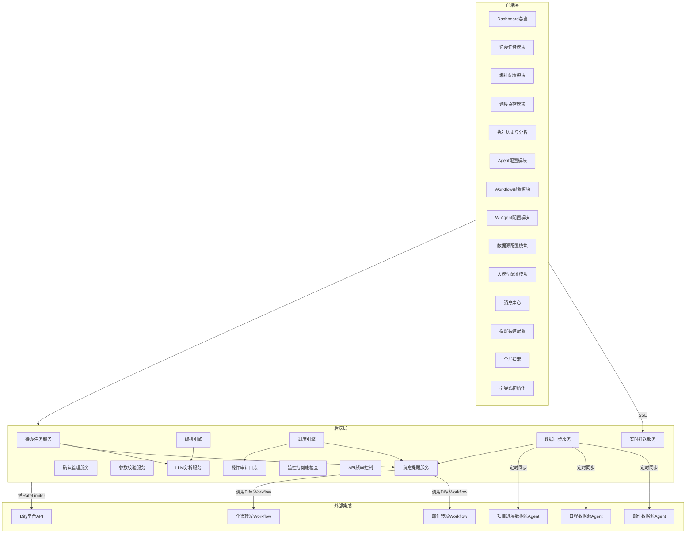
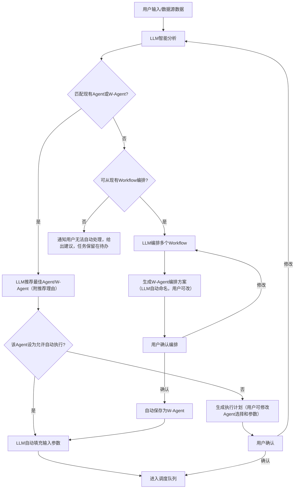

# Audit Coworker 项目需求文档 (PRD)

---

## 一、项目概述

**项目名称**：Audit Coworker

**项目定位**：基于 Dify 平台已有 Agent 和 Workflow，构建一套面向审计部门的智能协同工作系统，核心能力为 **待办任务提醒** 和 **任务智能处理（编排 + 调度）**。

**产品形态**：Web 应用（浏览器访问）+ 移动端适配（响应式设计）

**V1 用户模式**：单用户使用（无需登录），数据模型预留多用户字段以便后续扩展

**界面语言**：中文

**核心概念定义**：

- **Agent**：Dify 平台上成熟的、可完整使用的工作流（完成型 / Completion），可独立完成一项完整业务，单次调用即返回结果
- **Workflow**：Dify 平台上的单功能模块，需多个配合使用
- **W-Agent**：由多个 Workflow 编排后保存而成的复合体，与 Agent 同级，可被复用和调度

---

## 二、技术栈与架构

### 2.1 技术栈（已确认）

- **前端**：React + TypeScript + Ant Design（推荐）
- **后端**：Python FastAPI（异步）
- **数据库**：V1 使用 SQLite，后续迁移至 PostgreSQL/MySQL
- **任务队列**：V1 基于数据库实现简单队列，后续升级为 Celery + Redis
- **实时推送**：SSE（Server-Sent Events）
- **Dify 集成**：通过 Dify REST API 调用（阻塞模式），Agent 均为完成型（Completion）
- **LLM 提供商**：支持多提供商灵活切换（OpenAI、Azure OpenAI、本地私有化模型如 DeepSeek/Qwen、通过 Dify 调用等）
- **API 文档**：FastAPI 自带 Swagger/OpenAPI 自动生成
- **部署**：V1 本地部署，后续升级为 Docker / Docker Compose

### 2.2 架构原则

- **模块化 / 可插拔设计**：每个功能模块独立开发、独立部署，模块间通过标准接口通信，优化某一模块不影响其他模块
- **前后端分离**：前端负责交互与展示，后端负责编排引擎、调度引擎及 Dify API 集成
- **事件驱动**：采用事件 / 消息机制实现模块间松耦合通信

---

## 三、功能模块详细需求

### 模块一：待办任务提醒

#### 3.1.1 用户手动录入待办

- 提供表单界面，字段包括：任务标题、描述、优先级（高/中/低）、截止时间、关联项目/业务、标签
- 支持批量导入（Excel .xlsx 格式）
- 录入后任务进入待办列表
- 用户可选择是否将该任务提交到智能编排流程（非强制，由用户决定）

#### 3.1.2 智能梳理待办

- 系统通过已配置的 3 个数据源 Agent（邮件、日程、近期项目进展）自动抓取信息
- LLM 将 3 个数据源数据合并分析（支持交叉关联），自动提取潜在待办任务
- **自动去重**：LLM 自动识别不同数据源中的重复任务并去重
- 智能梳理结果以列表形式呈现给用户，每条包含：来源标识、任务描述、LLM 建议优先级（用户可修改）、建议截止时间
- **LLM 推荐理由**：每条梳理结果附带推荐理由，默认折叠，用户可展开查看
- **用户确认流程**：用户可逐条或批量 确认/修改/拒绝 梳理结果，确认后正式进入待办列表
- **大数据量处理**：当数据源数据量超过 LLM 上下文窗口时，采用「先摘要再详细分析」的两步法处理

#### 3.1.3 待办任务管理

- **视图切换**：支持列表视图（表格形式）和看板视图（按状态分列）两种视图切换
- 支持按优先级、截止时间、来源、状态筛选和排序
- 任务状态流转：待确认 → 待处理 → 处理中 → 已完成 / 已取消 / 异常
- 提醒机制：到期提醒、即将到期预警
- **已完成任务自动归档**：完成后的任务可配置自动归档时间（如完成后 7 天自动归档），归档后不在主视图显示，可在归档列表查看

---

### 模块二：任务智能处理

#### 3.2.1 配置管理（5 个独立配置界面）

**A. Agent 配置界面**

- 展示 Dify 平台上所有可用 Agent 列表
- 基础配置项：Agent 名称、描述、能力标签、Dify API 端点、API Key
- **输入参数配置**（与 Dify 一致）：
  - 每个输入参数需定义：参数名称（name）、参数类型（string / number / boolean / object / array / file）、是否必填、默认值、参数说明
  - 支持以表格形式逐条添加/删除输入参数
  - 参数格式需与 Dify Agent 的输入变量定义保持一致，确保调用时参数正确传递
- **输出参数配置**（与 Dify 一致）：
  - 每个输出参数需定义：参数名称（name）、参数类型（string / number / boolean / object / array）、参数说明
  - 定义输出结果的解析规则，以便后续 Workflow 编排或任务结果展示时能正确提取数据
- 支持启用/禁用、测试连通性（测试时可填入样例输入，验证输出格式是否正确）
- **超时配置**：设置单次调用的最大等待时间，超时自动标记失败
- **自动执行配置**：配置"匹配该 Agent 时是否允许自动执行"——开启后，智能编排匹配到该 Agent 时无需用户确认即可直接执行；关闭则需用户确认
- **执行前确认配置**：配置该 Agent 的调度任务执行前是否需要用户确认——可按 Agent 粒度控制

**B. Workflow 配置界面**

- 展示 Dify 平台上所有可用 Workflow 列表
- 基础配置项：Workflow 名称、描述、功能标签、Dify API 端点、API Key
- **输入参数配置**（与 Dify 一致）：
  - 每个输入参数需定义：参数名称（name）、参数类型（string / number / boolean / object / array / file）、是否必填、默认值、参数说明
  - 支持以表格形式逐条添加/删除输入参数
  - 参数格式需与 Dify Workflow 的输入变量定义保持一致
- **输出参数配置**（与 Dify 一致）：
  - 每个输出参数需定义：参数名称（name）、参数类型（string / number / boolean / object / array）、参数说明
  - 输出参数定义是 W-Agent 编排时 Workflow 间数据对接的基础
- 支持启用/禁用、测试连通性（测试时可填入样例输入，验证输出格式是否正确）
- **超时配置**：设置单次调用的最大等待时间，超时自动标记失败

**C. W-Agent 配置界面（手动创建）**

- 用户从 Workflow 列表中选取多个 Workflow
- **V1 列表式步骤编排**：按顺序排列步骤，定义执行顺序和数据流转关系（后续版本升级为拖拽式流程图）
- **Workflow 间参数映射**：基于各 Workflow 已配置的输入/输出参数定义，以可视化方式将上游 Workflow 的输出参数映射到下游 Workflow 的输入参数（需进行类型兼容性校验）
- 支持设置：执行顺序（串行/并行/条件分支）、循环逻辑配置、时间排期
- **自动执行配置**：与 Agent 一致，配置"匹配该 W-Agent 时是否允许自动执行"以及"执行前是否需要用户确认"
- **W-Agent 整体输入/输出定义**：
  - W-Agent 的输入 = 第一个（或多个入口）Workflow 的输入参数，需定义：参数名称、参数类型、是否必填、默认值、参数说明
  - W-Agent 的输出 = 最后一个（或多个出口）Workflow 的输出参数，需定义：参数名称、参数类型、参数说明
  - 输入/输出定义格式与 Agent 保持统一，使 W-Agent 与 Agent 在调度层完全同级
- **版本管理**：
  - 每次保存 W-Agent 编排方案自动生成版本号（v1、v2、v3...）
  - 支持查看历史版本列表、版本间差异对比
  - 支持一键回滚到指定历史版本
  - LLM 自动编排生成的 W-Agent 同样记录版本
- **执行中编辑保护**：当 W-Agent 正在被调度执行时，允许编辑但保存为新版本，不影响当前正在执行的版本
- **禁用保护**：禁用 Agent/Workflow/W-Agent 时，若其正在被调度队列中的任务使用，系统提示用户确认，用户可选择"禁用并重新编排受影响任务"或"禁用并取消受影响任务"
- 保存后生成 W-Agent，与 Agent 同级管理

**D. 数据源配置界面**

- 配置 3 个数据源对应的 Dify Agent：
  - 邮件 Agent：配置邮件获取的 Agent 端点、认证信息、筛选规则
  - 日程 Agent：配置日程获取的 Agent 端点、认证信息、日历范围
  - 项目进展 Agent：配置项目进展获取的 Agent 端点、认证信息、项目范围
- 数据源 Agent 同样需配置输入参数（如查询时间范围、筛选条件）和输出参数（返回数据结构定义），以便系统正确调用并解析返回数据
- 每个数据源可独立测试和启用/禁用

**E. 大模型（LLM）配置界面**

本系统中待办任务梳理、智能编排、智能调度三个环节均依赖大模型进行分析与决策，各环节的 LLM 需求和 Prompt 策略不同，因此需**分别独立配置**：

- **待办任务梳理 LLM 配置**：
  - 模型选择（模型提供商、模型名称、API 端点、API Key）
  - 模型参数（Temperature、Top-P、Max Tokens 等）
  - Prompt 模板管理：定义从数据源数据中提取待办任务的 Prompt 模板，支持编辑和版本管理
  - 测试功能：可输入样例数据源数据，预览 LLM 梳理结果
- **智能编排 LLM 配置**：
  - 模型选择（模型提供商、模型名称、API 端点、API Key）
  - 模型参数（Temperature、Top-P、Max Tokens 等）
  - Prompt 模板管理：定义任务分析和 Agent/W-Agent 匹配、Workflow 编排的 Prompt 模板，支持编辑和版本管理
  - 上下文注入配置：定义向 LLM 提供的上下文信息范围（可用 Agent 列表及其能力描述、可用 Workflow 列表及其输入输出定义等）
  - 测试功能：可输入样例任务描述，预览编排结果
- **智能调度 LLM 配置**：
  - 模型选择（模型提供商、模型名称、API 端点、API Key）
  - 模型参数（Temperature、Top-P、Max Tokens 等）
  - Prompt 模板管理：定义调度决策（时间排期优化、冲突处理、循环策略等）的 Prompt 模板，支持编辑和版本管理
  - 测试功能：可输入样例编排方案，预览调度计划
- **通用配置说明**：
  - 三个 LLM 可配置为相同或不同的模型实例，灵活满足不同精度/成本需求
  - 支持配置请求超时时间和重试策略
  - 支持配置 Token 用量上限和费用预警
- **LLM 用量与成本追踪**：
  - 记录每次 LLM 调用的 Token 用量（input tokens + output tokens）
  - 按天/周/月统计各环节（待办梳理/编排/调度）的 Token 消耗和预估费用
  - 用量达到预设阈值时自动告警
  - 提供用量趋势图表，辅助成本优化决策
- **用户偏好学习**：
  - 记录用户对智能梳理结果的确认/修改/拒绝历史
  - 记录用户对编排方案的修改模式（如常用的 Agent 偏好、编排习惯）
  - 将历史偏好数据作为 LLM Prompt 的补充上下文注入，逐步提高推荐准确率
  - 偏好数据可在界面查看和手动清除/重置

#### 3.2.2 智能编排

**核心流程**：

- **输入来源**：
  - 数据源同步后 LLM 自动分析提取的任务（每个任务独立编排、独立调度）
  - 用户手动录入后选择提交到智能编排的任务
- **输入分析**：LLM 对用户输入（对话、日程、会议记录等）或数据源数据进行语义分析，提取任务意图
- **智能匹配**：
  - 优先从现有 Agent 和 W-Agent 中选取可完成该任务的最佳选项
  - 匹配依据：Agent/W-Agent 的名称 + 描述 + 能力标签 + 输入/输出参数定义
  - LLM 推荐结果附带推荐理由，默认折叠，用户可展开查看
  - **用户可修改**：LLM 推荐但用户可手动更换为其他 Agent/W-Agent
- **自动参数填充**：LLM 根据任务描述自动填写所选 Agent/W-Agent 的输入参数，用户可修改
- **Workflow 编排**：当无匹配时，LLM 根据任务需求从可用 Workflow 中选取并编排
- **无法处理的情况**：当 LLM 无法匹配现有 Agent/W-Agent 且无法从 Workflow 编排出方案时，通知用户"无法自动处理"，给出建议（如"建议创建 XX 类型的 Workflow"），任务保留在待办中等待手动处理
- **W-Agent 自动保存**：用户确认编排方案后，自动保存为 W-Agent，名称由 LLM 自动生成，用户可修改
- **时间排期**：每个任务/子任务需标注计划开始时间、预计耗时、截止时间
- **优先级**：LLM 建议优先级，用户可修改
- **任务依赖关系**：
  - 编排时支持定义任务间依赖（任务 B 依赖任务 A 的输出）
  - 以 DAG（有向无环图）形式管理依赖，防止循环依赖
  - 编排确认页可视化展示依赖关系图
- **循环编排**：支持标记某些任务为循环任务，配置循环周期（每小时/每天/每周/自定义 cron 表达式）
- **用户确认**：编排方案需用户确认后方可执行（已配置"允许自动执行"的 Agent/W-Agent 除外）

#### 3.2.3 智能调度

- **调度引擎**：按编排方案的时间排期依次调度执行
- **执行时间窗口**：可按周一至周日每天单独配置允许执行的时间段（如工作日 9:00-18:00，周末不执行），超出时间窗口的任务自动延后到下一个可用时段
- **依赖检查**：调度执行前自动检查前置依赖任务是否完成；前置任务未完成则当前任务自动等待；前置任务失败则依赖它的后续任务标记为"阻塞"并通知用户
- **执行前确认**（按 Agent/W-Agent 配置是否需要）：
  - 需确认的任务：执行前弹出提示窗口
  - 提示窗口内容：任务名称、将调用的 Agent/W-Agent、预计耗时、输入参数摘要
  - 用户可选择：立即执行 / 延后（选择延后时间）/ 跳过 / 取消
  - 已配置"无需执行前确认"的 Agent/W-Agent 对应的任务直接执行
- **确认超时策略**：
  - 默认超时时长：30 分钟（可在系统设置中调整）
  - 超时后默认动作：自动延后
  - 延后时长可配置，设置最大重试次数，超过最大次数后自动跳过该任务
  - 用户不在线时，确认请求通过消息提醒（站内 + 外部渠道）推送
- **自动重试策略**：
  - 任务执行失败后自动重试，默认 3 次，指数退避间隔（1 分钟、2 分钟、4 分钟）
  - 重试次数和间隔可配置
  - 超过重试次数后通知用户手动处理
- **执行超时与熔断**：
  - 每个 Agent/Workflow 调用按其配置的超时时间执行，超时自动标记失败并通知用户
  - 同一 Agent/Workflow 连续失败达到阈值时触发熔断（默认 3 次，可配置），暂停调用并告警，待人工排查后恢复
- **并发控制与优先级队列**：
  - 系统最大并发调度数可配置（同时执行的任务上限）
  - 调度队列堆积时按任务优先级排序执行
  - 高优先级任务支持插队
- **手动暂停与取消**：用户可手动暂停或取消一个正在进行的调度计划
- **执行结果反馈闭环**：
  - 调度任务执行成功后，自动将对应的待办任务状态更新为"已完成"
  - 调度任务执行失败后，对应待办任务标记为"异常"
  - 确保待办列表与调度面板状态始终同步
- **执行结果展示**：默认根据输出参数定义格式化展示（表格/卡片形式），可切换查看原始 JSON 数据
- **执行日志**：日志级别可配置（简洁模式：仅开始/结束时间、状态、错误信息；详细模式：含完整输入输出、Dify API 调用详情、耗时明细）
- **循环调度**：
  - 对标记为循环的任务，按循环周期复用上次的编排方案重新执行
  - 仅首次循环需要用户确认，后续自动执行
- **调度监控界面**：
  - 展示所有任务的调度状态：待执行 → 待确认 → 执行中 → 已完成 / 失败 / 已跳过 / 已阻塞 / 已暂停
  - 每个任务可展开查看：调用的 Agent/Workflow、输入参数、输出结果、执行日志、耗时、依赖关系
  - 甘特图视图（V1 仅展示，后续支持拖拽调整排期）和列表视图切换
  - 失败任务支持重试
- **优雅停机与任务恢复**：
  - 系统重启/更新时，正在执行的任务保存中间状态，标记为"中断"
  - 重启后自动检测中断任务，提示用户选择恢复执行或重新调度

#### 3.2.4 数据同步机制

- **同步频率**：可配置（如每 30 分钟 / 每小时 / 每天等），在系统设置中统一配置
- **手动触发**：用户可在界面上手动触发一次数据同步（不等待定时）
- **首次同步**：数据源配置完成后立即执行一次同步
- 同步后 LLM 将 3 个数据源数据合并分析（支持交叉关联），自动提取新待办并去重
- **冲突处理**：当同步数据与已确认的编排/调度计划产生冲突时（如日程变更导致时间冲突），LLM 自动调整计划后提交用户确认
- 更新内容需推送给用户确认：
  - 新增待办任务 → 确认后加入待办列表
  - 调度计划变更 → 确认后更新调度队列
- 同步状态可在界面查看（上次同步时间、同步结果、下次计划同步时间）

---

### 模块三：消息提醒

#### 3.3.1 提醒触发场景

系统在以下所有关键节点自动触发消息提醒：

| 序号  | 触发场景         | 提醒内容              | 优先级 |
| --- | ------------ | ----------------- | --- |
| 1   | 智能梳理待办需用户确认  | 新梳理出 N 条待办任务，请确认  | 中   |
| 2   | 调度任务执行前确认    | 任务「XXX」即将执行，请确认   | 高   |
| 3   | 编排/调度计划变更需确认 | 数据源同步后计划有变更，请确认   | 中   |
| 4   | 任务执行完成       | 任务「XXX」已完成，查看结果   | 低   |
| 5   | 任务执行失败       | 任务「XXX」执行失败，请处理   | 高   |
| 6   | 数据源同步完成/有新待办 | 数据同步完成，新增 N 条待办   | 中   |
| 7   | 任务即将到期预警     | 任务「XXX」将于 X 小时后到期 | 高   |
| 8   | 任务已超期        | 任务「XXX」已超期，请处理    | 高   |
| 9   | 循环任务触发       | 循环任务「XXX」新一轮已触发   | 中   |

#### 3.3.2 提醒渠道

支持 **站内通知** 和 **外部渠道推送** 两类，用户可按场景和渠道灵活配置：

**A. 站内通知**

- 系统内通知中心：统一收纳所有提醒消息，支持已读/未读标记、按类型筛选、批量处理
- 页面内弹窗/Toast：需即时确认的高优先级场景（如执行前确认）以弹窗形式呈现
- 顶部通知角标：未处理消息数量实时显示

**B. 外部渠道推送（通过 Dify Workflow 实现）**

外部渠道推送统一通过调用 Dify 平台上已有的 Workflow 实现，无需系统直接对接 SMTP 或企微 API：

- **邮件转发 Workflow**：调用 Dify 上已实现的邮件转发 Workflow，系统只需配置该 Workflow 的端点、API Key 及输入参数（收件人、主题、正文等）
- **企业微信转发 Workflow**：调用 Dify 上已实现的企微转发 Workflow，系统只需配置该 Workflow 的端点、API Key 及输入参数（接收人/群、消息内容等）
- 各渠道 Workflow 可独立启用/禁用
- 配置方式与 Workflow 配置页一致（端点、API Key、输入/输出参数定义），复用同一套参数配置规范
- 如未来需要扩展其他渠道（如钉钉），只需在 Dify 上新建对应 Workflow 后在此处新增配置即可

#### 3.3.3 用户提醒偏好设置

- 用户可按场景配置提醒渠道（如"任务失败"同时发站内通知+邮件+企业微信，"任务完成"仅站内通知）
- 支持配置免打扰时段（如非工作时间仅保留站内通知，不发外部推送）
- 支持配置提醒频率合并策略（如同类消息在短时间内大量产生时合并为摘要推送，避免消息轰炸）
- 支持配置到期预警提前量（如提前 1 小时 / 提前 30 分钟）

#### 3.3.4 消息中心界面

- 统一的消息列表页面，展示所有历史消息提醒
- 支持按消息类型（待确认/任务完成/任务失败/计划变更/同步通知/到期预警/循环触发）筛选
- 支持按时间范围筛选
- 消息状态：未读 → 已读 → 已处理
- 需确认类消息可直接在消息中心内操作（跳转到对应确认页面或内联确认）
- 消息保留策略配置（如保留最近 30 天/90 天）

#### 3.3.5 提醒渠道配置界面

- 作为配置管理的子页面或独立页面
- 配置各外部推送渠道对应的 Dify Workflow 连接信息：
  - 邮件转发 Workflow：Dify API 端点、API Key、输入参数映射（收件人字段名、主题字段名、正文字段名等，与 Dify Workflow 输入变量保持一致）
  - 企微转发 Workflow：Dify API 端点、API Key、输入参数映射（接收人/群字段名、消息内容字段名等，与 Dify Workflow 输入变量保持一致）
  - 预留扩展位：支持添加新的推送渠道 Workflow（如钉钉、飞书等），配置方式统一
- 每个渠道支持发送测试消息验证连通性（调用对应 Workflow 发送测试内容）

---

### 模块四：Dashboard 总览

#### 3.4.1 总览页面

- 作为系统登录后的默认首页
- **关键指标卡片**：
  - 今日待办数量 / 待确认事项数 / 正在执行任务数 / 今日已完成数 / 失败任务数
  - 下一个即将执行的任务及倒计时
- **快捷入口**：
  - 一键跳转待确认列表（智能梳理确认、编排确认、执行前确认）
  - 一键跳转失败任务列表
  - 最近使用的 Agent/W-Agent 快捷调用
- **概览图表**：
  - 近 7 天任务完成趋势
  - 各 Agent/W-Agent 调用频次排行
  - 数据源同步状态摘要（上次同步时间、是否正常）

---

### 模块五：执行历史与数据分析

#### 3.5.1 执行历史

- 保留所有历史任务的完整执行记录
- 每条记录包含：任务名称、调用的 Agent/W-Agent/Workflow 链路、输入参数、输出结果、执行日志、开始时间、结束时间、耗时、最终状态
- 支持按时间范围、Agent/W-Agent 名称、执行状态筛选查询
- 支持导出历史记录（CSV/Excel）

#### 3.5.2 数据分析

- **Agent/W-Agent 维度统计**：调用频次、平均耗时、成功率、失败原因分布
- **任务维度统计**：各来源（手动/邮件/日程/项目进展）的任务数量占比、平均处理时长
- **LLM 用量统计**：各环节 Token 消耗趋势、费用统计（与 LLM 配置模块联动）
- 数据分析结果为优化编排策略、调整 Prompt、选择合适模型提供依据

---

### 模块六：全局搜索

#### 3.6.1 搜索能力

- 提供顶部全局搜索栏，支持跨模块搜索
- 搜索范围：待办任务、Agent/Workflow/W-Agent 名称与描述、调度记录、执行历史、消息通知
- 搜索结果分类展示，点击可直接跳转到对应详情页
- 支持关键词高亮、模糊匹配

---

### 模块七：引导式初始化

#### 3.7.1 Setup Wizard

- 首次使用系统时自动触发（检测到无任何配置时）
- 分步引导用户完成初始配置：
  - 第 1 步：配置大模型（至少完成一个环节的 LLM 配置）
  - 第 2 步：配置数据源（至少配置一个数据源 Agent）
  - 第 3 步：配置 Agent / Workflow（至少录入一个）
  - 第 4 步：配置提醒渠道（至少配置一个外部推送渠道）
  - 第 5 步：完成，跳转 Dashboard
- 每一步提供说明文字和示例，降低使用门槛
- 可跳过，后续在各配置页单独完成

---

### 模块八：系统设置

#### 3.8.1 统一系统设置页

汇总所有全局配置项，集中管理：

- **执行时间窗口**：按周一至周日每天单独配置允许执行的时间段
- **并发调度上限**：系统同时执行的最大任务数
- **数据同步频率**：定时同步间隔配置
- **确认超时默认值**：执行前确认的默认超时时长（默认 30 分钟）及超时默认动作（默认自动延后）
- **自动重试默认值**：默认重试次数（默认 3 次）及间隔策略（默认指数退避）
- **熔断阈值默认值**：连续失败触发熔断的次数（默认 3 次）
- **数据保留策略**：消息保留时长、执行历史保留时长、审计日志保留时长分别配置
- **已完成任务归档**：完成后自动归档的天数（默认 7 天）
- **Dify API 频率限制**：调用速率上限配置（QPS/QPM）

---

### 模块九：配置管理增强

#### 3.9.1 配置导入/导出

- 支持将 Agent、Workflow、W-Agent、数据源、LLM、提醒渠道等配置项批量导出为 JSON 文件
- 支持从 JSON 文件导入配置，用于环境迁移（开发 → 测试 → 生产）或备份恢复
- 导入时进行冲突检测（同名配置提示覆盖/跳过/重命名）

---

## 四、非功能性需求

- **模块化**：每个模块独立开发、独立可插拔，通过标准化接口（REST API / 事件总线）通信
- **导航布局**：左侧边栏导航（企业管理系统常见布局）
- **V1 单用户模式**：无需登录，数据模型预留 user_id 字段以便后续扩展多用户
- **操作审计日志**：
  - 所有操作（配置变更、任务确认/拒绝、手动触发调度等）记录不可篡改的审计日志
  - 日志内容：操作时间、操作类型、操作对象、操作前后数据快照
  - 支持按时间、操作类型筛选查询
  - V1 审计日志存储在同一数据库的独立表中（后续可迁移至独立存储）
  - 审计日志不可通过界面删除或修改
- **异常处理**：调度任务失败时需告警、支持自动重试（指数退避）、支持回退
- **Dify API 异常降级**：
  - Dify 平台不可用时：缓存上次同步结果、暂停自动调度、通知用户手动处理
  - 记录 Dify API 调用健康状态（成功率、延迟），异常时自动告警
- **Dify API 调用频率控制**：
  - 系统侧配置调用速率上限（QPS/QPM），适配 Dify 平台的频率限制
  - 超限时排队等待，避免直接报错
- **实时状态推送**：
  - 采用 SSE（Server-Sent Events）实现前端实时感知状态变更
  - 覆盖场景：调度任务状态变更、数据同步完成、新消息通知等
  - 避免前端轮询，降低服务端压力
- **系统监控与健康检查**：
  - 各后端服务提供健康检查端点（FastAPI 自带）
  - 关键指标监控：Dify API 调用延迟/错误率、LLM 调用延迟/Token 消耗、调度队列长度、数据同步成功率
  - 异常时通过消息提醒模块的外部渠道自动告警
- **性能**：数据同步和调度任务需支持并发处理，避免阻塞

---

## 五、页面清单

| 序号  | 页面                   | 所属模块      | 说明                                  |
| --- | -------------------- | --------- | ----------------------------------- |
| 1   | Dashboard 总览页        | Dashboard | 关键指标、快捷入口、概览图表                      |
| 2   | 待办任务列表（含手动录入）        | 待办任务提醒    | 列表/看板切换、Excel批量导入、筛选排序、可提交到编排       |
| 3   | 智能梳理结果确认页            | 待办任务提醒    | LLM梳理结果+推荐理由（折叠）、去重标识、逐条/批量确认       |
| 4   | Agent 配置页            | 配置管理      | 输入/输出参数、超时、自动执行/执行前确认配置，与Dify一致     |
| 5   | Workflow 配置页         | 配置管理      | 输入/输出参数、超时配置，与Dify一致                |
| 6   | W-Agent 配置页（手动创建/编辑） | 配置管理      | V1列表式编排、参数映射、输入输出定义、版本管理、执行中编辑保护    |
| 7   | 数据源配置页               | 配置管理      | 3个数据源Agent配置，含输入输出参数、同步频率           |
| 8   | 大模型配置页               | 配置管理      | 三个LLM分别配置、多提供商切换、用量追踪、偏好学习          |
| 9   | 配置导入/导出页             | 配置管理      | 批量导出/导入JSON，冲突检测                    |
| 10  | 智能编排确认页              | 任务智能处理    | 编排方案+推荐理由（折叠）、依赖关系图、时间排期、用户可修改Agent |
| 11  | 调度监控面板               | 任务智能处理    | 甘特图/列表视图、任务状态、依赖、暂停/取消操作            |
| 12  | 任务执行前确认弹窗            | 任务智能处理    | 弹窗式确认：执行/延后/跳过/取消                   |
| 13  | 执行历史页                | 执行历史      | 完整执行记录查询、筛选、导出CSV/Excel             |
| 14  | 数据分析页                | 执行历史      | Agent调用统计、任务统计、LLM用量统计图表            |
| 15  | 消息中心                 | 消息提醒      | 全部消息列表、筛选、已读/未读/已处理状态管理             |
| 16  | 提醒渠道配置页              | 消息提醒      | 配置邮件/企微转发Dify Workflow端点与参数映射       |
| 17  | 用户提醒偏好设置页            | 消息提醒      | 按场景配置渠道、免打扰时段、合并策略、预警提前量            |
| 18  | 系统设置页                | 系统        | 执行时间窗口、并发上限、同步频率、超时/重试/熔断默认值、数据保留策略 |
| 19  | 引导式初始化（Setup Wizard） | 系统        | 首次使用分步引导配置，可跳过                      |
| 20  | 全局搜索（顶部搜索栏）          | 全局        | 跨模块搜索待办/Agent/调度/消息，结果分类跳转          |
| 21  | 操作审计日志页              | 系统管理      | 不可篡改的操作日志查询、筛选                      |

---

## 六、后续优化规划（当前版本暂不实现）

以下功能保留在后续版本中优化实现：

### 6.1 附件/文件处理

- 审计任务常涉及文档（审计报告、底稿、证据等），Agent/Workflow 的输入输出可能包含文件
- 需明确文件类型参数的上传、存储、传递和下载机制
- 需设计文件存储服务（本地/对象存储）、文件大小限制、格式白名单等

### 6.2 用户管理与权限控制（详细版）

- 当前版本仅在非功能性需求中保留基础权限控制
- 后续版本需细化：
  - 用户注册/登录（或对接企业 SSO/LDAP）
  - 角色定义：管理员（全部权限）、普通用户（使用权限）、配置员（配置管理权限）等
  - 各页面/操作的详细权限矩阵
  - 数据隔离（不同用户/团队的数据可见性）

### 6.3 多人协作

- 任务指派/转交给团队成员
- 团队视图：按成员分组展示待办和调度状态
- 协作评论：任务详情中添加评论/备注，支持 @提及
- 需依赖用户管理与权限体系

### 6.4 其他远期优化方向

- **数据源扩展性**：将数据源设计为可扩展的插件架构，未来可添加企业微信消息、OA 审批等新数据源
- **安全与合规增强**：数据加密存储、传输加密、敏感数据脱敏展示
- **LLM Prompt A/B 测试**：支持同时运行多版本 Prompt 并对比效果
- **拖拽式 W-Agent 编排**：升级为类似 Dify/n8n 的可视化节点连线编排界面
- **甘特图拖拽排期**：调度监控的甘特图支持拖拽调整任务时间排期
- **待办任务导出**：支持导出待办任务列表为 Excel
- **数据备份与恢复**：自动定期备份数据库
- **深色模式（Dark Mode）**
- **Docker / Docker Compose 部署**：容器化部署方案
- **数据库升级**：从 SQLite 迁移至 PostgreSQL/MySQL
- **任务队列升级**：从数据库队列升级为 Celery + Redis

---

## 七、开发前待完成的设计工作

技术栈已确认（见第二章），以下设计工作需在编码前完成：

- **API 设计规范**：各模块间的 RESTful API 接口契约需提前定义（FastAPI 自动生成 OpenAPI 文档）
- **数据模型设计**：Agent、Workflow、W-Agent、WAgentVersion、Task、Schedule、LLMConfig、AuditLog、Notification、UserPreference、SyncRecord 等核心实体的数据库模型（SQLAlchemy ORM）
- **Dify API 参数标准化层**：在系统与 Dify 之间增加参数适配层，将本系统配置的输入/输出参数定义自动转换为 Dify REST API 要求的格式
- **参数类型自动校验**：W-Agent 编排时 Workflow 间参数映射应自动进行类型兼容性校验
- **LLM Prompt 初始模板**：为待办梳理、智能编排、智能调度三个环节设计初始 Prompt 模板
- **前端路由与组件结构**：基于页面清单规划 React Router 路由表和左侧边栏导航结构
